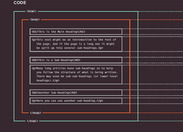
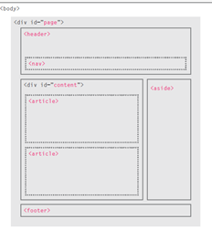
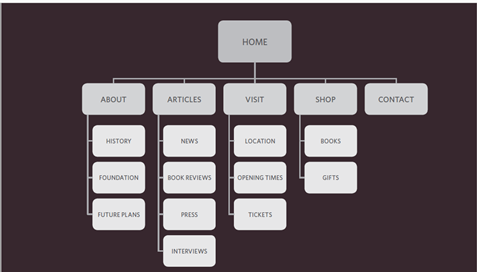
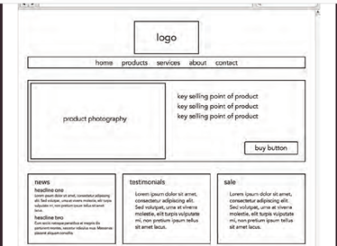
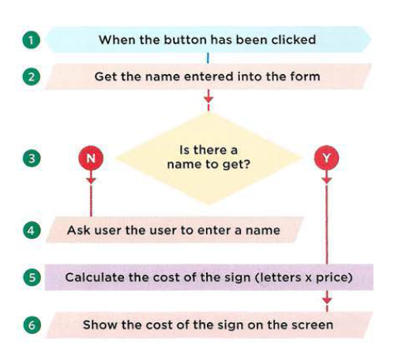
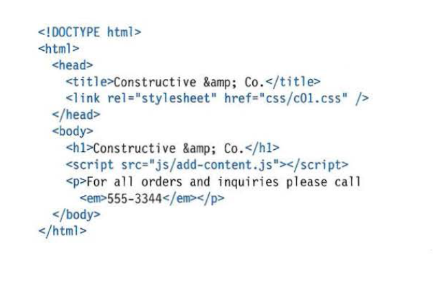

# HTML
## introduction

### How People Access the Web:
#### Browsers
People access websites using software called a web browser.
#### Web Servers
When you ask your browser for a web page, the request is sent across the Internet to a special computer known as a web server which hosts the website.
#### Screen readers
Screen readers are programs that read out the contents of a computer screen to a user. They are commonly used by people with visual impairments.

### How Websites Are Created:
#### How it is Created
Small websites are often written just using HTML and CSS.
Larger websites — in particular those that are updated regularly and use a content management system (CMS), blogging tools, or e-commerce software — often make use of more complex technologies on the web server, but these technologies are actually used to produce HTML and CSS that is then sent to the browser. So, if your site uses these technologies, you will be able to use your new HTML and CSS knowledge to take more control over how your site looks.

#### How the Web Works:
When you visit a website, the web server hosting that site could be anywhere in the world. In order for you to find the location of the web server, your browser will first connect to a Domain Name System (DNS) server.

## Structure
#### HTML Uses Elements to Describe the Structure of Pages

Tags act like containers.They tell you something about the information that lies between their opening and closing tags.

The opening < html > tag indicates that anything between it and a closing </html> tag is HTML code.
The < body > tag indicates that anything between it and the closing
< / body > tag should be shown inside the main browser window.
Words between < h1 > and </ h1 > are a main heading.
A paragraph of text appears between these < p > and </ p > tags.
Words between < h2 > and </ h2 > form a sub-heading.
Here is another paragraph between opening < p > and closing </ p > tags.
Another sub-heading inside < h2 > and </ h2 > tags.
Another paragraph inside < p > and </ p > tags.
The closing </ body > tag indicates the end of what should appear in the main browser window.
The closing </ html > tag indicates that it is the end of the HTML code.

##### Attributes Tell Us More About Elements
Attributes provide additional information about the contents of an element. They appear on the opening tag of the element and are made up of two parts: a name and a value,separated by an equals sign.

The attribute name indicates what kind of extra information you are supplying about the element's content. It should be
written in lowercase.
The value is the information or setting for the attribute. It should be placed in double quotes. Different attributes can
have different values.

##### < body >
You met the < body > element in the first example we created. Everything inside this element is shown inside the main browser window.
##### < head >
Before the < body > element you will often see a < head > element. This contains information about the page (rather than information that is shown within the main part of the browser window that is highlighted in blue on the opposite page).
You will usually find a < title > element inside the < head > element.
##### < title >
The contents of the < title > element are either shown in the top of the browser, above where you usually type in the URL of the page you want to visit, or on the tab for that page (if your browser uses tabs to allow you to view multiple pages at the same time).

# Extra Markup
#### DOCTYPEs
Because there have been several versions of HTML, each web page should begin with a DOCTYPE declaration to tell a browser which version of HTML the page is using (although browsers usually display the page even if it is not included).

#### Comments in HTML

#### ID Attribute
Every HTML element can carry the id attribute. It is used to uniquely identify that element from other elements on the page. Its value should start with a letter or an underscore (not a number or any other character).

#### Class Attribute

Every HTML element can also carry a class attribute. Sometimes, rather than uniquely identifying one element within a document, you will want a way to identify several elements as being different from the other elements on the page.

#### Block Elements
Some elements will always appear to start on a new line in the browser window. These are known as block level elements.
Examples of block elements are < h1 >, < p >, < ul >, and < li >.

#### Inline Elements
Some elements will always appear to continue on the same line as their neighbouring elements. These are known as inline elements.
Examples of inline elements are
< a >, < b >, < em >, and < img >.

#### Grouping Text & Elements In a Block
< div >
 block-elements.html HTML The < div > element allows you to group a set of elements together in one block-level box.

 # HTML5 Layout

HTML5 introduces a new set of elements that allow you to divide up the parts of a page. The names of these elements indicate the kind of content you will find in them. They are still subject to change, but that has not stopped many web page authors using them already.

This example has exactly the same structure as seen on the previous page. However, many of the < div > elements have been replaced by new HTML5 layout elements.
For example, the header sits inside a new < header > element, the navigation in a < nav > element, and the articles are in
individual < article > elements.

##### Headers & Footers
< header > < footer >
The < header > and < footer > elements can be used for:
* The main header or footer that appears at the top or bottom of every page on the site.
* A header or footer for an individual < article > or < section > within the page.

##### Navigation
< nav >

The < nav > element is used tocontain the major navigational blocks on the site such as the primary site navigation.

##### Figures
< figure > < figcaption >
It can be used to contain any content that is referenced from the main flow of an article (not just images).

# Process & Design

##### Who is the Site For?
Every website should be designed for the target audience—not just for yourself or the site owner. It is therefore very important to understand who your target audience is.

##### Target Audience: individuals
###### What is the age range o ●● f your target audience?
* Will your site appeal to more women or men? What is the mix?
* Which country do your visitors live in?
* Do they live in urban or rural areas?
* What is the average income of visitors?
* What level of education do they have?
* What is their marital or family status?
* What is their occupation?
* How many hours do they work per week?
* How often do they use the web?
* What kind of device do they use to access the web?

##### Why People Visit YOUR Website

Now that you know who your visitors are, you need to consider why they are coming. While some people will simply chance across your website, most will visit for a specific reason.

To help determine why people are coming to your website, there are two basic categories of questions you can ask:
* The first attempts to discover the underlying motivations for why visitors come to the site.
* The second examines the specific goals of the visitors.These are the triggers making them come to the site now.

##### What Your Visitors are Trying to Achieve
It is unlikely that you will be able to list every reason why someone visits your site but youare looking for key tasks and motivations. This information can help guide your site designs.
First you want to create a list of reasons why people would be coming to your site.

##### What Information Your Visitors Need
You may want to offer additional supporting information that you think they might find helpful. Look at each of the reasons whypeople will be visiting your site and determine what they need to achieve their goals.

##### How Of ten People Will Visit Your Site
Some sites benefit from being updated more frequently than others. Some information (such as news) may be constantly changing, while other content remains relatively static.

##### Site Maps
The aim is to create a diagram of the pages that will be used to structure the site. This is known as a site map and it will show how those pages can be grouped.

##### WireFrames
A wireframe is a simple sketch of the key information that needs to go on each page of a site. It shows the hierarchy of the information and how much space it might require.

# JAVASCRIPT

##### HOW JAVASCRIPT makes web makes web pages more interactive
* access content 
* modify content
* program rules
* react to events

## The ABC of programming
##### What is a script and how do i create one

A SCRIPT IS A SERIES OF INSTRUCTIONS
A script is a series of instructions that acomputer can follow to achieve a goal.

##### WRITING ASCRIPT
To write a script, you need to first state your goal and then list the tasks that need to be completed in order to achieve it.

##### FROM STEPS TO CODE
Every step for every task shown in a flowchart needs to be written in a language the computer can understand and follow.

You need to learn to "think" like a computer because they solve tasks in different ways than you or I might approach them.

##### SKETCHING OUT THE TASKS IN A FLOWCHART
Often scripts will need to perform different tasks in different situations. You can use flowcharts to work out how the tasks fit together. The flowcharts show the paths between each step.

### How do computers fit in with the world around them?
COMPUTERS CREATE MODELS OF THE WORLD USING DATA

##### OBJECTS & PROPERTIES
OBJECTS (THINGS) In computer programming, each physica l thing in the world can be represented as an object.

Each object can have its own:
* Properties
* Events
* Methods
Together they create a working model of that object. PROPERTIES (CHARACTERISTICS)

Each property has a name and a value, and each of these name/value pairs tells you something about each individual instance of the object. The most obvious property of this hotel is its name. The value for that property is Quay.

##### EVENTS
In the real world, people interact with objects. These interactions can change the values of the properties in these objects.
###### WHAT IS AN EVENT?
There are common ways in which people interact with each type of object. For example, in a car a driver will typically use at least two pedals. The car has been designed to respond differently when the driver interacts with each of the different pedals:
* The accelerator makes the car go faster.
* The brake slows it down.

##### METHODS
Methods represent things people need to do with objects. They can retrieve or update the values of an object's properties.
###### WHAT IS A METHOD?
Methods typically represent how people (or other things) interact with an object in the real world.
They are like questions and instructions that:
* Tell you something about that object (using
information stored in its properties)
* Change the value of one or more of that object's

###### WHAT DOES A METHOD DO?
The code for a method can contain lots of instructions that together represent one task. When you use a method, you do not always need to know how it achieves its task; you just need to know how to ask the question and how to interpret any answers it gives you.

### How do i write a script for a web page
##### CREATING A BASIC JAVASCRIPT
JavaScript is written in plain text, just like HTML and CSS, so you do not need any new tools to write a script. This example adds a greeting into an HTML page. The greeting changes depending on the time of day.

* Create a folder to put the example , then start up your favorite code editor, and enter the text to the right. A JavaScript file is just a text file (like HTML and CSS files are) but it has a . j s file extension, so save this file with the name add-content .js

* Get the CSS and images for this example from the website that accompanies the book:
www.javascriptbook. com To keep the files organized, in the same way that CSS files often live in a folder ca lled styles or css, your JavaScript files can live in a folder called scripts,javascript,orjs. In this case, save your file in a folder called js

#####LINKING TO A JAVASCRIPT
FILE FROM AN HTML PAGE When you want to use JavaScript with a web page, you use the HTML < script > element to tell the browser it is coming across a script. Its s re attribute tells people where the JavaScript file is stored.

