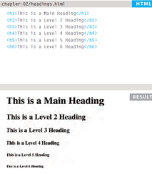
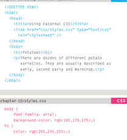
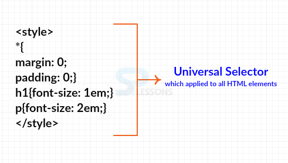
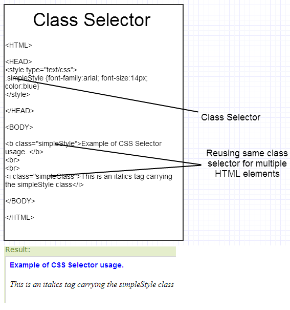
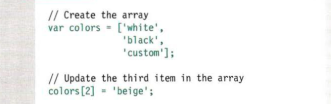
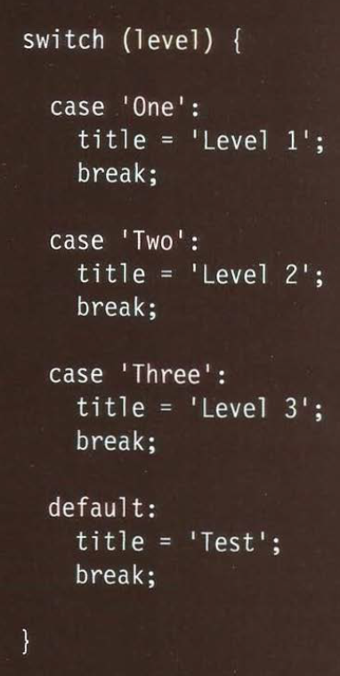

# HTML
## Text in html

When creating a web page, you add tags (known as markup) to the contents of the page. These tags provide extra meaning and allow browsers to show users the appropriate structure for the page.

### How many heading you think we have ?
HTML has six "levels" of headings:
< h1 > is used for main headings
< h2 > is used for subheadings and the othe will be smaller in the size.

## Paragraph

### < p >

#### for what you think is for paragraph tag?
To create a paragraph, surround the words that make up the paragraph with an opening < p > tag and closing < /p > tag.

### Bold & Italic
#### < b >< /b > tag
it is for make characters appear bold.
#### < i >< /i > tag
it is for make characters appear italic.

### Superscript & Subscript

#### < sup >
The < sup > element is used to contain characters that should be superscript.

#### < sub >
The < sub > element is used to contain characters that should be subscript.

##### now what do you think will happen if you insert white spaces in paragraph??
When the browser comes across two or more spaces next to each other, it only displays one space. Similarly if it comes across a line break, it treats that as a single space too. This is known as white space collapsing. 

##### How we can to add a line break inside the middle of a paragraph?
by  < br > tag

##### How we can create a break between themes??

##### what the element indicates that its content has strong importance??

< strong > tag

##### There are two elements commonly used for marking up quotations:
1. < blockquote >
2. < q>

##### < cite > tag is used when you are referencing a piece of work such as a book, film or research paper.

##### what if you want to define new terminology??
you should use <dfn > tag

##### < address > 
The < address > element has quite a specific use: to contain contact details for the author of the page.

##### how you can insert a line under the word??

insert the tag < ins >

##### how you can insert a line through the word??

insert the tags < del  > or < s >

## Introducing CSS

A CSS rule contains two parts: a selector and a declaration

CSS : sit inside curly brackets and each is made up of two parts: a property and a value, separated by a colon. You can specify several properties in one declaration, each separated by a semi-colon.

##### Using External CSS

link the css file in htnl file by < link href="put the path here" >.

##### Using Internal CSS

you dont need to use file of css you can create inside html file.

##### type of selector
###### 1. universal selector 
 apply to all element in document.

###### 2. Type Selector 
Matches element names.

###### 3. Class Selector
Matches an element whose class attribute has a value that matches the one specified after the period (or full stop) symbol.

###### 4. ID Selector

# JAVASCRIPT

##### PLACING THE SCRIPT IN THE PAGE
You may see JavaScript in the HTML between opening < script > and closing < /script > tags (but it is better to put scripts in their own files).

##### How to use objects & methods

ex :

document.write("  ")
document is object represents the entire web page.
 the dot is member operator.
 method:allow new content to be written into page.

#####  A script:
is a series of instructions that a computer can follow one-by-one. Each individual instruction or step is known as a statement.Statements should end with a semicolon.

##### How you can write a comment?
###### MULTI-LINE COMMENTS
To write a comment that stretches over more than one line, you use a multi-line comment, starting with the /* characters and ending with the * / characters.Anything between these characters is not processed·by the JavaScript interpreter.

###### SINGLE-LINE COMMENTS
In a single-line comment, anything that follows the two forward slash characters I/ on that line will not be processed by the JavaScript interpreter. Singleline comments are often used for short descriptions of what the code is doing.

###### WHAT IS A VARIABLE?
A script will have to temporarily store the bits of information it needs to do its job. It can store this data in variables.

How to declare variable?
var num;

How to assign value?
num=3;

mention the data type
1. Numaric data type. 
2. string data type.
3. boolean data type.

now creating an array:
You create an array and give it a name just like you would any other variable (using the var keyword followed by the name of the array).

ACCESSING & CHANGING VALUES IN AN ARRAY

##### EXPRESSIONS
An expression evaluates into (results in) a single value. Broadly speaking there are two types of expressions.

##### OPERATORS

Expressions rely on things called operators; they allow programmers to
create a single value from one or more values.

##### ARITHMETIC OPERATORS
1. Addition
2. Subtraction
3. Multiplication
4. Division

## SWITCH STATEMENTS
A switch statement starts with a variable called the switch value. Each case indicates a possible value for this variable and the code that should run if the variable matches that value.

##### why we need  switch statment?
when we have a variable with more than one possible so instead of use a lot of if statments and else we can use switch statment.

