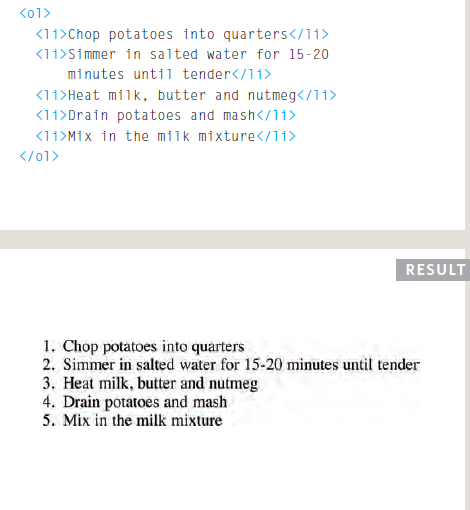
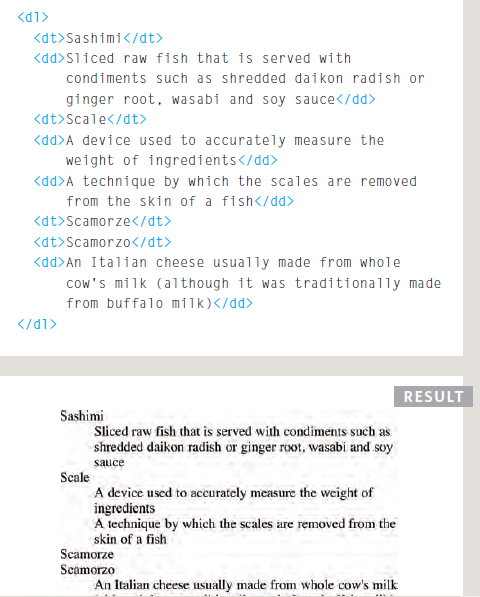
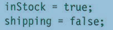

# HTML

## list

### HTML provides three different types of list':'

1. Ordered lists are lists where each item in the list is numbered.

The ordered list is created with the '<'ol'>' element.

Each item in the list is placed between an opening '<'li'>' tag and a closing '<'/li'>' tag. (The li stands for list item.)

2. Unordered lists are lists that begin with a bullet point .

The unordered list is createdwith the '<'ul'>' element.

Each item in the list is placed between an opening '<'li'>' tag and a closing <'/li> tag. (The li stands for list item.)

3. Definition lists are made up of a set of terms along with the definitions for each of those terms.

##### do you think you can make list inside alist?
yes you can and it's call Nested Lists

## Boxes

### this section on CSS

The CSS box model is essentially a box that wraps around every HTML element. It consists of: margins, borders, padding, and the actual content. The image below illustrates the box model:

1. Content - The content of the box, where text and images appear
2. Padding - Clears an area around the content. The padding is transparent
3. Border - A border that goes around the padding and content
4. Margin - Clears an area outside the border. The margin is transparent

#### Width and Height of an Element

set your own dimensions for a box you can use the height and width properties.

The most popular ways to specify the size of a box are to use pixels, percentages, or ems.

### Limiting Width
#### min-width, max-width
Some page designs expand and shrink to fit the size of the user's screen. In such designs, the min-width property specifies the smallest size a box can be displayed at when the browser window is narrow, and the max-width property indicates the maximum width a box canstretch to when the browser window is wide.

### Limiting Height
#### min-height, max-height
In the same way that you might want to limit the width of a box on a page, you may also want to limit the height of it. This is achieved using the min-height and max-height properties.

#### what if the content withen the box is larger then the box itself?

we can use property call overflow has two value :
* hidden:hides the extra content. 
* scroll:adds scrollbar to the box to seeing missing content.

### Border, Margin & Padding

### Border Width
You can control the individual size of borders using four separate properties:
1. border-top-width
2. border-right-width
3. border-bottom-width
4. border-left-width

The values here appear in clockwise order: top, right, bottom, left.

### Border Style
#### border-style

You can control the style of a border using the border-style property.

This property can take the following values:
1. solid
2. dotted
3. double
4. groove
5. ridge
6. inset
7. outset
8. hidden/none

### you can color it to by :
1. border-top-color
2. border-right-color
3. border-bottom-color
4. border-left-color

### you can Centering Content by :property text-align:center;

### CSS3 BORDER IMAGE
#### border-image

The border-image property applies an image to the border of any box. It takes a background image and slices it into nine pieces.

### CSS3 Box Shadows
#### box-shadow

The box-shadow property allows you to add a drop shadow around a box.

### CSS3: Rounded Corners
#### border-radius

CSS3 introduces the ability to create rounded corners on any box, using a property called
border-radius. The value indicates the size of the radius in pixels.

# JAVASCRIPT

### USING A VARIABLE TO STORE A BOOLEAN

Boolean has two value :True or False

## SWITCH STATEMENTS
A switch statement starts with a variable called the switch value. Each case indicates a possible value for this variable and the code that should run if the variable matches that value.

##### why we need  switch statment?
when we have a variable with more than one possible so instead of use a lot of if statments and else we can use switch statment.

