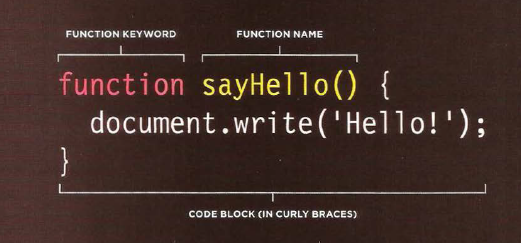
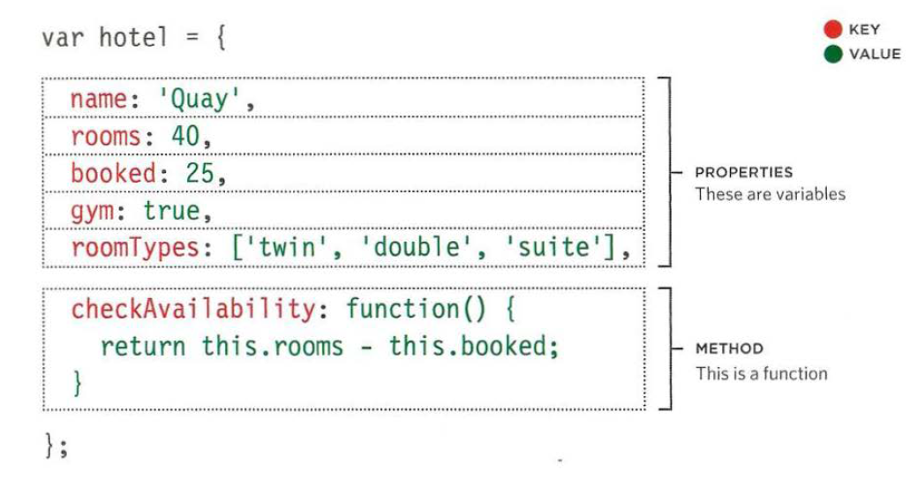
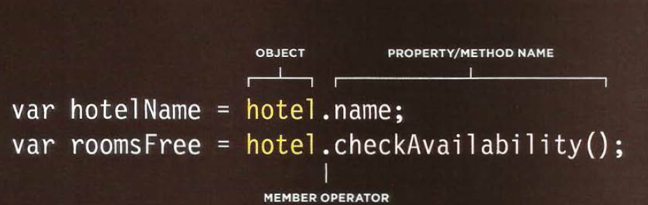

# Reading of today

# HTML

#### What if you want to add a link to your web page and how you can add it by html

##### lets learn now how to add links

Links are created using the < a > element. Users can click on anything
between the opening < a > tag and the closing < /a > tag.

you put the link you want it in the href and when you click the it the website will appear.
it is will appear like this in your page:

#### you can to lonk your pages in your website by relative urls and it's a shorthand way of telling the browser where to find your files.

lets say you have these folders

so the examplearts folder it the parent of:

- images
- movies
- music
- theater

and they are a child of examplearts folder
the examplearts folder grandparent of dvd folder

now how to link them in the webpage
lets assume we are in reviews.html how to link same page < a href="reviews.html">Review< /a >

now add child folder < a href="music/listings html">Listings< /a>
now add Grandchild Folder < a href="movies/dvd/reviews.html">

now add Parent Folder < a href="../index.html">Home< /a>

finally add GrandParent Folder < a href="../../index.html">Home< /a>

you can to link mail by add email to href

##### if you want make the link open in new tab you can add attribute target:"\_blank"

#### Do you think you can move to top page or bottom page

yes you can

by add id to the tag you want then link whenever you want < a href ="#add thte id here" >

# LAYOUT

now you can control where each element sits
on a page and how to create attractive
page layouts

#### Block-level elements

start on a new line
Examples include:
< h1 > < p > < ul > < li >

#### Inline elements

flow in between
surrounding text
Examples include:
< img > < b> < i>

you can contain more than one element in html by tag call < div >you can put elements here</ div>

#### CSS allow you to control the layout of a page: normal

1. normal flow(position:static)
2. Relative position (position:relative)
3. Absolute Positioning(position:absolute)
4. Fixed Positioning(position:Fixed)
5. Overlapping Elements(z-index)
6. Fl oating Elements(float)

# JAVASCRIPT

## FUNCTIONS,METHOD & OBJECTS

FUNCTIONS & OBJECTS
Functions consist of a series of statements that have been grouped together because they perform a specific task.
A method is the same as function, except methods are created inside (and are part of) an object.

BUILT-IN METHODS OBJECTS
The browser comes with a set of objects that act like a toolkit for creating interactive web pages.

declaring function

calling function by sayhello();

you can return value by (return value;).and want to send a values when you call the fun sayhello("hi","hello")

there is two kind of function

1.  FUNCTION DECLARATION
2.  FUNCTION EXPRESSION

## WHAT IS AN OBJECT?

Objects group together a set of variables and functions to create a model.

calling object :

# Pair Programming

How does pair programming work?
Wpair programming commonly involves two roles: the Driver and the Navigator. The Driver is the programmer who is typing and the only one whose hands are on the keyboard.the Driver manages the text editor, switching files, version control, and—of course writing—code. The Navigator uses their words to guide the Driver but does not provide any direct input to the computer. The Navigator thinks about the big picture, what comes next, how an algorithm might be converted in to code, while scanning for typos or bugs. The Navigator might also utilize their computer as a second screen to look up solutions and documentation, but should not be writing any code.

Why pair program?

there are four fundamental skills that help anyone learn a new language:Listening, hearing and interpreting the vocabulary ,Speaking

1. Greater efficiency:when two people focus on the same code base, it is easier to catch mistakes in the making. Research indicates that pair programing takes slightly longer, but produces higher-quality code that doesn’t require later effort in troubleshooting and debugging
2. Engaged collaboration
   When two programmers focus on the same code, the experience is more engaging and both programmers are more focused than if they were working alone. It is harder to procrastinate or get off track when someone else is relying on you to complete the work.
3. Learning from fellow students
   Everyone has a different approach to problem solving; working with a teammate can expose developers to techniques they otherwise would not have thought of. If one developer has a unique approach to a specific problem, pair programming exposes the other developer to a new solution.
4. Social skills
   Pair programming not only improves programming skills, but can also help programmers develop their interpersonal skills.
5. Job interview readiness
   he ability to work with and learn from others and stellar communication skills are as (or more!) important to a company than specific technical skills. Pair programming strengthens all of those skills.
6. Work environment readiness
   Many companies that utilize pair programing expect to train fresh hires from CS-degree programs on how they operate to actually deliver a product. Code Fellows graduates who are already familiar with how pairing works can hit the ground running at a new job, with one less hurdle to overcome.
