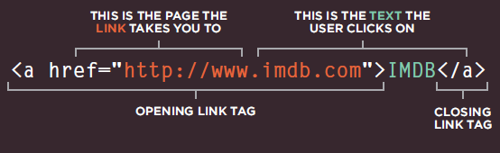
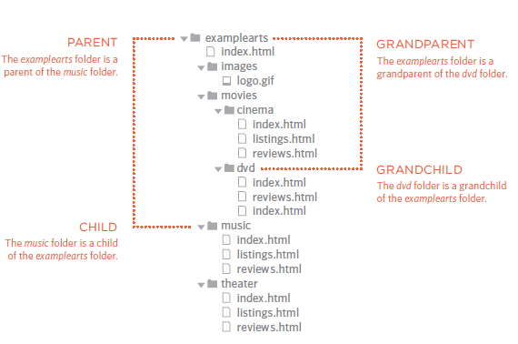

# Reading of today

# HTML

#### What if you want to add a link to your web page and how you can add it by html

##### lets learn now how to add links

Links are created using the < a > element. Users can click on anything
between the opening < a > tag and the closing < /a > tag.

you put the link you want it in the href and when you click the it the website will appear. 
it is will appear like this in your page:

#### you can to lonk your pages in your website by relative urls and it's a shorthand way of telling the browser where to find your files.

lets say you have these folders

so the examplearts folder it the parent of:
* images
* movies
* music
* theater 

and they are a child of examplearts folder
the examplearts folder grandparent of dvd folder

now how to link them in the webpage
lets assume we are in reviews.html how to link same page < a href="reviews.html">Review< /a >

now add child folder < a href="music/listings html">Listings< /a>
 now add Grandchild Folder < a href="movies/dvd/reviews.html">

 now add Parent Folder < a href="../index.html">Home< /a>

 finally add GrandParent Folder < a href="../../index.html">Home< /a>

 you can to link mail by add email to href

 ##### if you want make the link open in new tab you can add attribute  target:"_blank"

 #### Do you think you can move to top page or bottom page 

 yes you can 

 by add id to the tag you want then link whenever you want < a href ="#add thte id here" >

 # LAYOUT

 now you can control where each element sits
on a page and how to create attractive
page layouts

#### Block-level elements
start on a new line
Examples include:
< h1 > < p > < ul > < li >

#### Inline elements
flow in between
surrounding text
Examples include:
< img > < b> < i>

you can contain more than one element in html by tag call < div >you can put elements here</ div>

#### CSS allow you to control the layout of a page: normal

1. normal flow(position:static)
2.  Relative position (position:relative)
3. Absolute Positioning(position:absolute)
4. Fixed Positioning(position:Fixed)
5. Overlapping Elements(z-index)
6. Fl oating Elements(float)