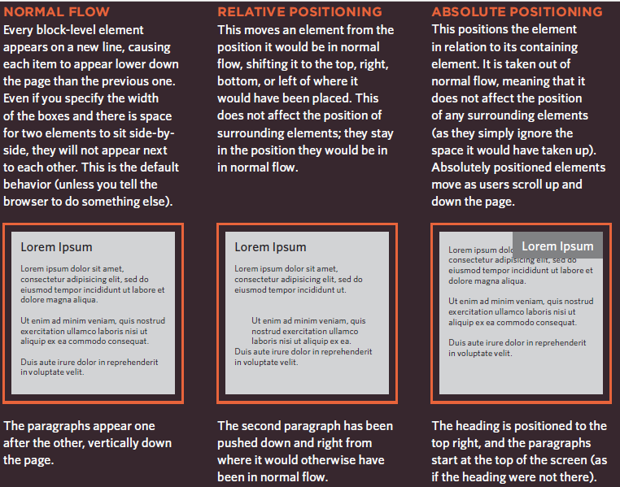
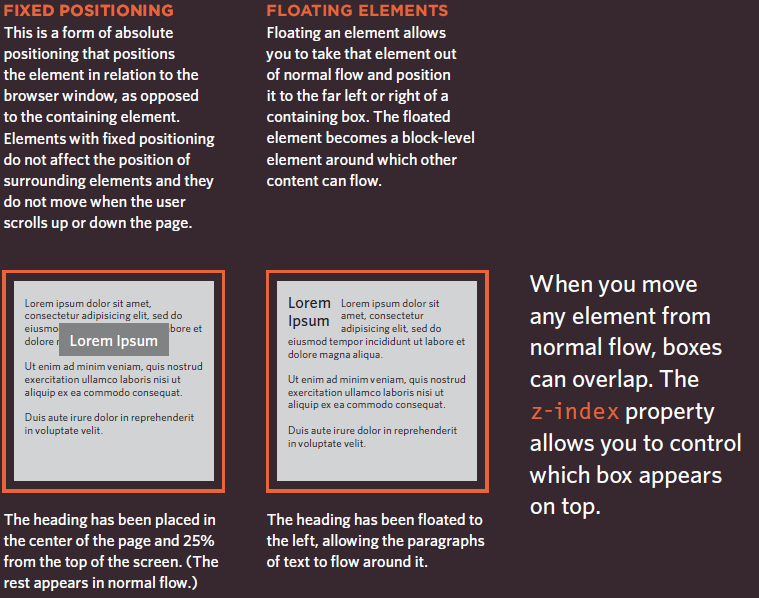

# HTML

## LAYOUT

now you can control where each element sits
on a page and how to create attractive
page layouts

Building Blocks
CSS treats each HTML element as if it is in its own box. This box will either be a block-level box or an inline box.

Block-level elements start on a new line Examples include:
< h1> < p> < ul> < li>
Inline elements flow in between surrounding text Examples include:
< img> < b> < i>

### Controlling the Position of Elements:

### Fixed Width Layouts

Fixed width layout designs do not change size as the user increases or decreases the size of their browser window.

### Liquid Layouts

Liquid layout designs stretch and contract as the user increases or decreases the size of their browser window. They tend to use percentages.

### you can use more than one style sheet so how you can use it :
by

1. @import
2. link

@import for exs:

1. @import url("tables.css");
2. @import url("typography.css");

link for exs:

1. < link rel="stylesheet" type="text/css" href="css/site.css" />
2. < link rel="stylesheet" type="text/css" href="css/tables.css" />
3. < link rel="stylesheet" type="text/css" href="css/typography.css" />