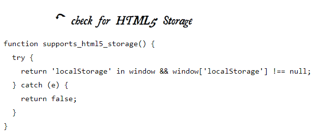
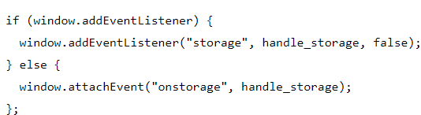
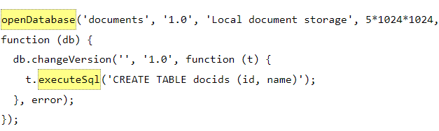

# THE PAST, PRESENT & FUTURE OF LOCAL STORAGE FOR WEB APPLICATIONS

so of course we need storage for our website let's talk about it 

first we have HTML5 STORAGE :it’s a way for web pages to store named key/value pairs locally, within the client web browser.

## HTML5 STORAGE SUPPORT

1. IE 8.0+
2. FIREFOX3.5+
3. SAFARI 4.0+
4. CHROME 4.0+
5. OPERA2.0+
6. IPHONE2.0+
7. ANDROID2.0+
you can check youe local storage in javascript code.

### USING HTML5 STORAGE

You store data based on a named key, then you can retrieve that data with the same key. The named key is a string. The data can be any type supported by JavaScript, including strings, Booleans, integers, or floats.

there is many objects you can use to using storage like:
setItem(),getItem(),removeItem(),key().

### TRACKING CHANGES TO THE HTML5 STORAGE AREA

If you want to keep track programmatically of when the storage area changes, you can trap the storage event.The storage event is fired on the window object whenever setItem(), removeItem(), or clear() is called and actually changes something

### SQL

an open source cross-browser plugin which included an embedded database based on SQLite

