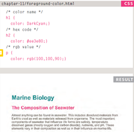
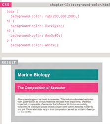

# Introducing CSS

CSS allows you to create rules that specify how the content of an element should appear.

CSS Properties Affect How Elements Are Displayed CSS declarations sit inside curly brackets and each is made up of two parts: a property and a value, separated by a colon. You can specify several properties in one declaration, each separated by a semi-colon.

h1, h2, h3 {
font-family: Arial;
color: yellow;}

Using External CSS

<link> external-css.html HTML
The <link> element can be used
in an HTML document to tell the
browser where to find the CSS
file used to style the page.

# Using Internal CSS

## \<style\>
You can also include CSS rules within an HTML page by placing
them inside a <style> element,
which usually sits inside the
<head> element of the page.
The <style> element should use
the type attribute to indicate
that the styles are specified in
CSS. The value should be text/
css.

## CSS Selectors:

| Selector | Meaning | example |
| ---  | --- | ----------- |
| Universal Selector | Applies to all elements in the document | * {} Targets all elements on the page |
| Type Selector | Matches element names | h1, h2, h3 \{ \} Targets the \< h1 \> \< h2 \> and \< h3 \> elements | Class Selector | Matches an element whose class attribute has a value that matches the one specified after the period (or full stop) symbol | .note \{ \} Targets any element whose class attribute has a value of note
 | ID Selector | Matches an element whose id attribute has a value that matches the one specified after the pound or hash symbol | #introduction \{ \} Targets the element whose id attribute has a value of introduction |

## Foreground Color
### color

## Background Color
### background-color

## CSS 3: Opacity
### opacity, rgba

opacity
property which allows you to specify the opacity of an element and any of its child elements. The value is a number between 0.0 and 1.0 (so a value of 0.5 is 50% opacity and 0.15 is 15% opacity).
The CSS3 rgba property allows you to specify a color, just like you would with an RGB value, but adds a fourth value to indicate opacity. This value is known as an alpha value and is a number between 0.0 and 1.0.

## CSS 3: HSL & HSLA
### hsl, hsla

#### hue
This is expressed as an angle
(between 0 and 360 degrees).