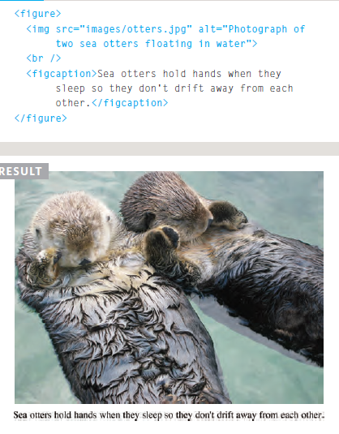

# HTML

## IMAGES

**what if you want to share photo about something you want and how to add this images in html**

first store the img in your website;create a folder for all of the images the site uses.

* you can add img by the tag < img src"here put the path of img">
* what if the pic broken and not available you can put attribute call (alt)
< img src"here put the path of img" alt="this imh not available">
* you can control the size of image to by attributes call width and height

image foramt

1. JPEG
2. GIF

#### HTML5 has introduced a new < figure> element to contain images and their caption so that the two are associated

#### < figcaption>

The < figcaption> element has been added to HTML5 in order to allow web page authors to add a caption to an image.

## color

you add colors to the bakground and to specify tag and to fonts

You can specify any color in CSS in one of three ways:

1. rgb values
2. hex codes
3. color names

* Background Color
* CSS3:Opacity
* CSS3:HSL & HSLA

## Text

you can  control styling of text by

### 1. font family

The font-family property allows you to specify the typeface that should be used for any text inside the element(s) to which a CSS rule applies.

### 2. font-size

The font-size property enables you to specify a size for the font. There are several ways to specify the size of a font.

### 3. @font-face

@font-face allows you to use a font, even if it is not installed on the computer of the person browsing, by allowing you to specify a path to a copy of the font.

### 4. font-style