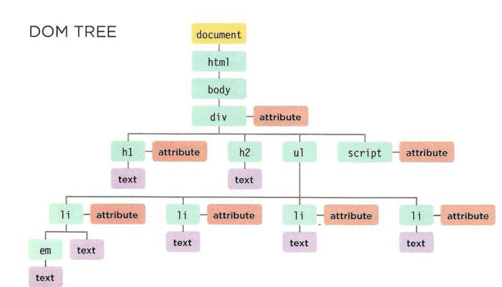
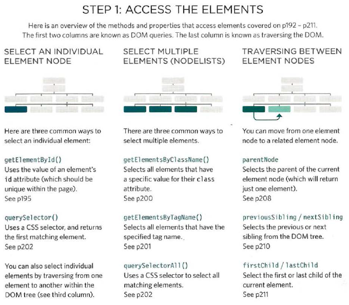
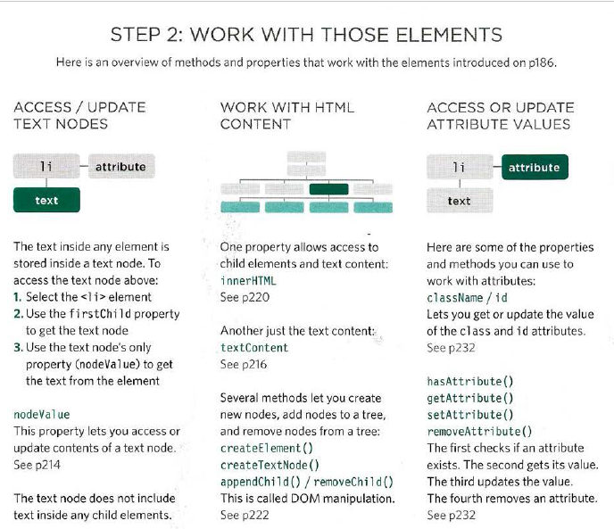
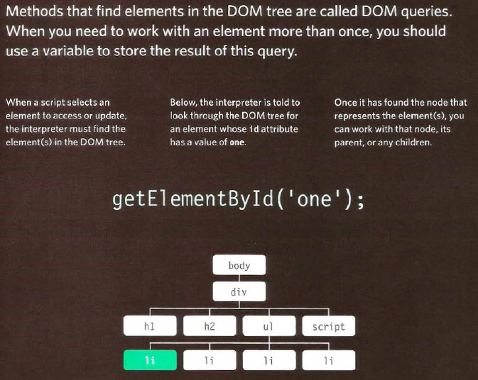
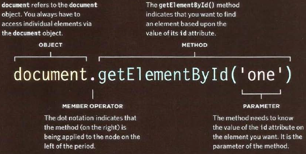

# Understanding The Problem Domain Is The Hardest Part Of Programming

## Why problem domains are hard?

you can’t really see what you are trying to build very clearly.

### What can you do about it?

If understanding the problem domain is the hardest part of programming and you want to make programming easier, you can do one of two things:

1. Make the problem domain easier
2. Get better at understanding the problem domain

you can cutting out cases and narrowing your focus to a particular part of the problem.

# JAVASCRIPT

## The Document Object Model (DOM)

is how browsers should create a model of an HTML page and how JavaScript can access and update the contents of a web page while it is in the browser window.

Each node is an object with methods and properties. Scripts access and update this DOM tree (not the source HTML file).Any changes made to the DOM tree are reflected in the browser.

WORKING WITH
THE DOM TREE
Accessing and updating the DOM tree involves two steps:
1: Locate the node that represents the element you want to work with.
2: Use its text content, child elements, and attributes.

### Here you can see four different DOM queries

1. getElementsByTagNam('h1')
2. getElementsByClassName('hot')
3. query SelectorA 11 ( ' l i [id] ' )
4. getElementsByTagName('li ')

THE item() METHOD
Nodelists have a method called item() which will return an individual node from the Node list.