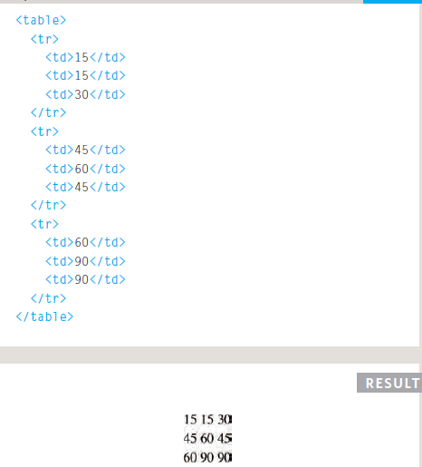
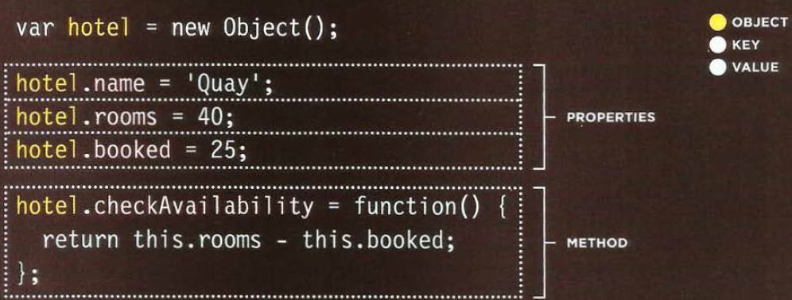
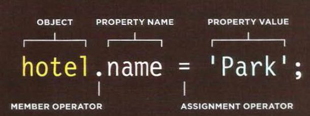

# Domain-Modeling

Domain modeling is the process of creating a conceptual model in code for a specific problem. A model describes the various entities, their attributes and behaviors.

 An entity that stores data in properties and encapsulates behaviors in methods is commonly referred to as an object-oriented model.

This is object-oriented programming in JavaScript at its most fundamental level.

1. The new keyword instantiates (i.e. creates) an object.
2. The constructor function initializes properties inside that object using the this variable.
3. The object is stored in a variable for later use.

 Domain modeling is the process of creating a conceptual model for a specific problem. And a domain model that's articulated well can verify and validate your understanding of that problem.

Here's some tips to follow when building your own domain models.

1. When modeling a single entity that'll have many instances, build self-contained objects with the same attributes and behaviors.
2. Model its attributes with a constructor function that defines and initializes properties.
3. Model its behaviors with small methods that focus on doing one job well.
4. Create instances using the new keyword followed by a call to a constructor function.
5. Store the newly created object in a variable so you can access its properties and methods from outside.
6. Use the this variable within methods so you can access the object's properties and methods from inside.

# HTML

## TABLE

A table represents information in a grid format.
how to create a table in html:

* put < table> tag to create table.
* < tr > tag for start each row.
* inside the < tr > tag put < td  > tag for each column in row
* you can also put < th > head after table tag to enter header for table

The colspan attribute can be used on a < th> or < td> element and indicates how many columns that cell should run across.

The rowspan attribute can be used on a < th> or < td> element to indicate how many rows a cell should span down the table.

## OBJECT

Objects group together a set of variables and functions to create a model of a something you would recognize from the real world. In an object, variables and functions take on new names.
IN AN OBJECT: VARIABLES BECOME KNOWN AS PROPERTIES.
IN AN OBJECT: FUNCTIONS BECOME KNOWN AS METHODS.

## update objects by 2 ways

Sometimes you will want several objects to represent similar things.

create fobject with constructor

function Hotel (name, rooms, booked) {
this.name=name;
this.rooms=rooms;
this.booked = booked;
this.checkAvailability = function() {
 return this.rooms - this . booked;
}

## ARRAYS are objects

var array =[but variable1,variable2,variable3,variable4]

## Three groups of built-in objects

1. browser object model
2. Document object model
3. Global javascript object(string,number,boolean)

### THE WINDOW OBJECT

| PROPERTY | DESCRIPTION |
| ---  | --- |
| window . innerHeight-01  | Height of window (excluding browser chrome/user interface) (in pixels) |
| window.innerWidth | Width of window (excluding browser chrome/user interface) (in pixels) |
| window.pageXOffset  | Distance document has been scrolled horizontally (in pixels) |
| window. pageYOffset | Distance document has been scrolled vertica lly (in pixels) |
| window.screenX  | X-coordinate of pointer, relative to top left corner of screen (in pixels) |
| window.screenY  | Y-coordinate of pointer, relative to top left corner of screen (in pixels) |
| window.location  | Current URL of window object (or local file path)   |
| window.document | Reference to document object, which is used to represent the current page contained in window |
| window.history | Reference to history object for browser window or tab, which contains details of pages that have been viewed in that window or tab |
| window.history.length | Number of items in hi story object for browser window or tab |
| window.screen | Reference to screen object |
| window.screen .width | Accesses screen object and finds value of its width property (in pixels) |
| window. screen.height | Accesses screen object and finds value of its height property (in pixels) |

| METHOD | DESCRIPTION |
| ---  | --- |
| window.a1ert() | Creates dialog box with message (user must cl ick OK button to close it) |
| window.open () |  Opens new browser window with URL specified as parameter (if browser has pop-up blocking software instaled,this method may not work) | | window.print() | Tells browser that user wants to print contents of current page (acts like user has clicked a print option in the browser's user interface) |

## THE DOCUMENT OBJECT

| PROPERTY | DESCRIPTION |
| ---  | --- |
| document.title | Title of current document  |
| document.lastModified | Date on which document was last modified |
| document.URL | Returns string containing URL of current document |
| document.domain | Returns domain of current document |

| METHOD | DESCRIPTION |
| ---  | --- |
| document.write() | Writes text to document  |
| document.getElementByld() | Returns element, if there is an element with the value of the id attribute that matches |
| document.querySe1ectorA1 | Returns string containing URL of current document |
| document.createElement() | Creates new element |
| document.createTextNode() | Creates new text node |

## GLOBAL OBJECTS:

### STRING OBJECT

| PROPERTY | DESCRIPTION |
| ---  | --- |
| length | Returns number of characters in the string in most cases |

| METHOD | DESCRIPTION |
| ---  | --- |
| toUpperCase() | Changes string to uppercase characters  |
| tolowerCase() | Changes string to lowercase characters |
| charAt () | Takes an index number as a parameter, and returns the character found at that position |
| indexOf()| Returns index number of the first time a character or set of characters is found within the string |
| lastlndexOf() | Returns index number of the last time a character or set of characters is found within the string |
| substring() | Returns characters found between two index numbers where the character for the first index number is included and the character for the last index number is not included |
| split() | When a character is specified, it splits the string each time it is found, then stores each individual part ih an array |
| trim() | Removes whitespace from start and end of string |
| replace() | Like find and replace, it takes one value that should be found, and another to replace it |

### NUMBER OBJECT

| METHOD | DESCRIPTION |
| ---  | --- |
| i sNaN() | Rounds to specified number of decimal places (returns a string)  |
| toFixed() | Changes string to lowercase characters |
| toPrecision() | Rounds to total number of places (returns a string) |toExponentia1() | Returns a string representing the number in exponential notation |

### MATH OBJECT

| PROPERTY | DESCRIPTION |
| ---  | --- |
| Math.PI | Returns pi (approximately 3.14159265359) |

| METHOD | DESCRIPTION |
| ---  | --- |
| Math.round() | Rounds number to the nearest integer |
| Math.sqrt (n) |Returns square root of positive number,e.g., Math.sqrt (9) returns 3 |
| Math.cei1() | Rounds number up to the nearest integer |
| Math.floor()| Rounds number down to the nearest integer |
| Math.random() | Generates a random number between 0 (inclusive) and 1 (not inclusive) |

creating instance of data object 

var today=new DATE();

| METHOD | DESCRIPTION |
| ---  | --- |
| getDate() setDate() | Returns I sets the day of the month (1-31) |
| getDay () |Returns the day of the week (0-6) |
| getFullYear() setFullYear() | Returns I sets the year (4 digits) |
| getHours() setHours()| Returns I sets the hour (0-23) |
| getMilliseconds() satMilliseconds()| Returns I sets the milliseconds (0-999) |
| getMinutes() setMinutes() | Returns I sets the minutes (0-59) |
| getMonth() setMonth() | Returns/ sets the month (0-11) |
| getSeconds() setSeconds() | Returns I sets the seconds (0-59) |
| get Time() setTime() | Number of milliseconds since January 1, 1970, |
| getTimezoneOffset |() Returns time zone offset in mins for local
| toDateString() | Returns "date" as a human-readable string |
| toTimeString() | Returns "time" as a human-readable string |
| to String() | Returns a string representing the specified date |
