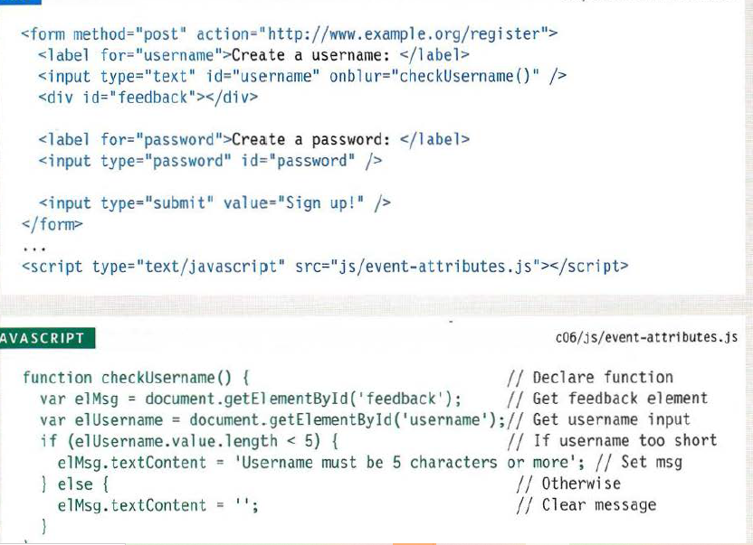
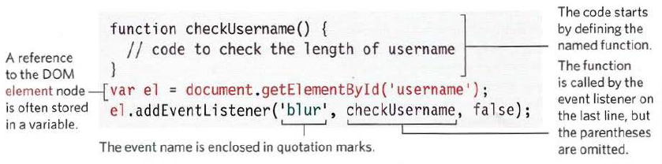
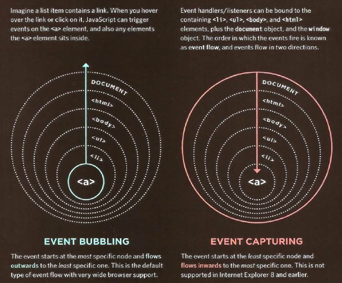

# HTML

## FORMS

Forms: help coders for collect data from users.

There are several types of form controls that you can use to collect information from visitors to your site.

ADDING TEXT:
Text input (single-line)
Password input
Text area (multi-line)

Making Choices:
Radio buttons.
Checkboxes.
Drop-down boxes.

Submitting Forms
Submit buttons
Image buttons

Uploading Files:
File upload

form structure:
< form >
text input
after create element form the create element < input>

< fieldset>
You can group related form controls together inside the < fieldset> element. This is particularly helpful for longer forms.

## LIST,TABLE AND FORMS

you can style ordered list and unorderd list.
list-style-type:
Unordered Lists
For an unordered list you can use
the following values:

1. none
2. disc
3. circle
4. square

Ordered Lists
For an ordered (numbered) list
you can use the following values:
decimal
1 2 3
decimal-leading-zero
01 02 03
lower-alpha
a b c
upper-alpha
A B C
lower-roman
i. ii. iii.
upper-roman
I II III
and you can add image for bullet  by:
list-style-image: url("url of image");

## Table Properties:

1. width
2. padding
3. text-transform
4. letter-spacing, font-size
5. border-top, border-bottom
6. text-align
7. background-color
8. :hover
9. empty-cells: show or hidden
10. border-spacing, border-collapse

## Styling Forms

Styling text input

1. font-size
2. color,background-color
3. border border-raduis
4. :focus,:hover
5. background-image

Styling Submit Buttons

1. color
2. text-shadow
3. border-bottom
4. background-color
5. :hover

Styling Fieldsets & Legends

1. color
2. background-color
3. border
4. border-raduis
5. padding

## JAVA SCRIPT

### EVENTS

events makes the page feel more interactive

HOW EVENTS TRIGGER JAVASCRIPT CODE?

1. Select the element node(s) you want the script to respond to.
2. Indicate which event on the selected node(s) will trigger the response.
3. State the code you want to run when the event occurs.

EVENT LISTENERS

Event listeners are a more recent approach to handling events. They can deal with more than one function at a time

Event flow
html elements nest inside other elements.if you hover or click on a link ,you also be hovering or clicking on its parents.

