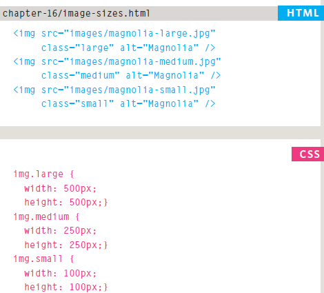
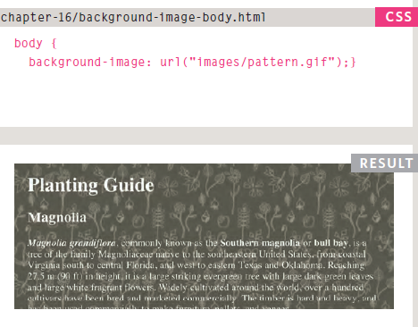

# HTML

## Images

You can control the size of an image using the width and height properties in CSS, just like you can for any other box.

Aligning images using CSS
by property called floatcan use it to move element to left or right.

also you can setthe image as backgroung in the page

you can control background by many attribute like:

1. repeat:The background image is repeated both horizontally and vertically.
2. repeat-x:The image is repeated horizontally only
3. repeat-y:The image is repeated vertically only.
4. no-repeat:0The image is only shown once.
5. fixed:The background image stays in the same position on the page.
6. scroll:The background image moves up and down as the user scrolls up and down the page.
7. background-position:

* left top
* left center
* left bottom
* center top
* center center
* center bottom
* right top
* right center
* right bottom

## Practical Information

Search Engine Optimization(SEO)
is the practice of trying to help your site appear nearer the top of search engine results when people look for the topics that your website covers.

In every page of your website there are seven key places where keywords(the words people might search on to find your site) can appear in order to improve its findability.

1. Page Title
2. URL/Web Address
3. Headings
4. Text
5. Link Text
6. Image Alt Text
7. Page Descriptions

## Video and Audio APIs

The < video> and < audio> elements allow us to embed video and audio into web pages. As we showed in Video and audio content, a typical implementation looks like this:

< video controls>
  < source src="rabbit320.mp4" type="video/mp4">
  < source src="rabbit320.webm" type="video/webm">
  < p>Your browser doesn't support HTML5 video. Here is a < a href="rabbit320.mp4">link to the video< /a > instead.</ p>
< /video >

Part of the HTML5 spec, the HTMLMediaElement API provides features to allow you to control video and audio players programmatically — for example HTMLMediaElement.play(), HTMLMediaElement.pause(), etc. This interface is available to both < audio> and < video> elements, as the features you'll want to implement are nearly identical. Let's go through an example, adding features as we go.

The < video> element contains two < source> elements so that different formats can be loaded depending on the browser viewing the site.