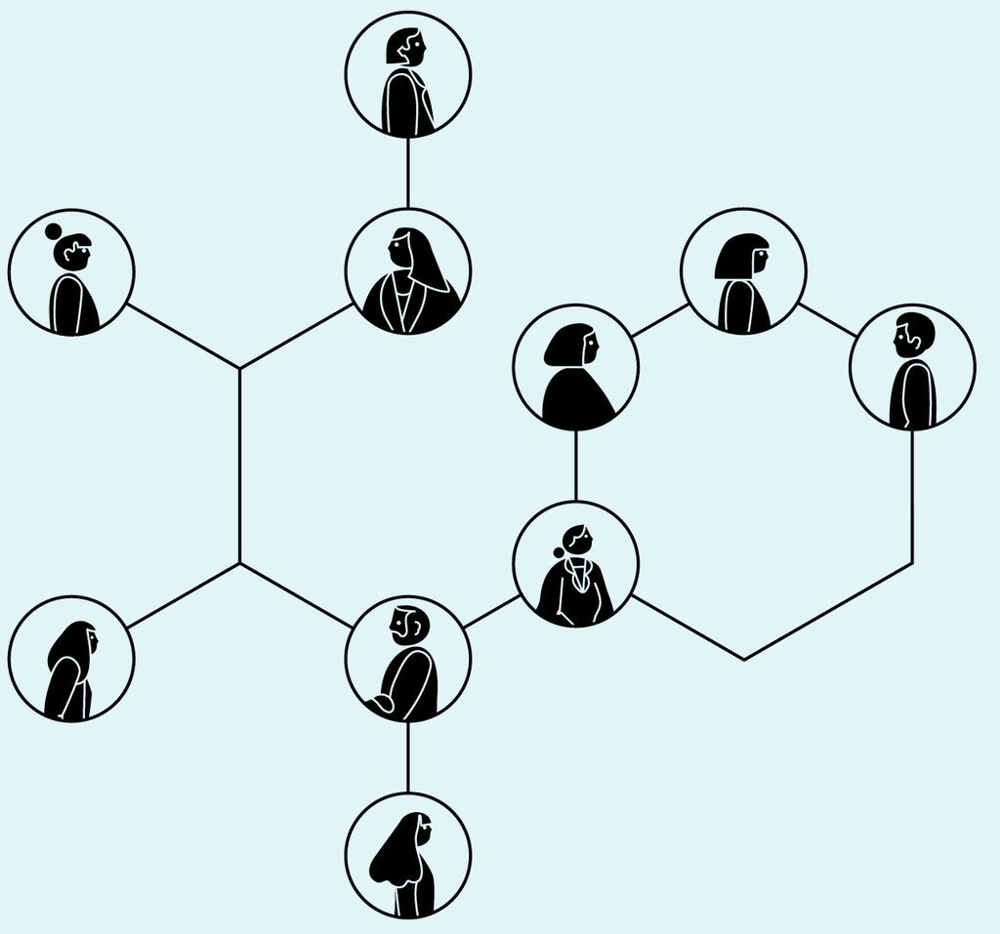
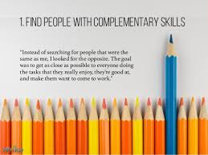
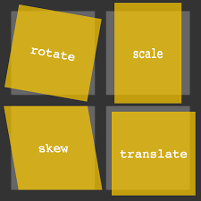

# What Google Learned About Teams

employee performance optimization — isn’t enough. As commerce becomes increasingly global and complex, the bulk of modern work is more and more team-based.

Studies show that people working in teams tend to achieve better results and report higher job satisfaction.

Five years ago, Google — one of the most public proselytizers of how studying workers can transform productivity — became focused on building the perfect team.

After looking at over a hundred groups for more than a year, Project Aristotle researchers concluded that understanding and influencing group norms were the keys to improving Google’s teams.

## CSS Transforms

in CSS3 there is a new way to position and alter elements.
The transform property comes in two different settings, two-dimensional and three-dimensional. Each of these come with their own individual properties and values.

## 2D Transforms

Two-dimensional transforms work on the x and y axes, known as horizontal and vertical axes.

## 2D Rotate

The transform property accepts a handful of different values. like : transform: rotate(20deg);

## 2D Scale

Using the scale value within the transform property allows you to change the appeared size of an element. like :transform: scale(.75);

## 2D Translate

The translate value works a bit like that of relative positioning, pushing and pulling an element in different directions without interrupting the normal flow of the document.

## 2D Skew

The last transform value in the group, skew, is used to distort elements on the horizontal axis, vertical axis, or both.like :transform: skewX(5deg);

## 3D Transforms

Working with two-dimensional transforms we are able to alter elements on the horizontal and vertical axes,  and z axis.

## Transitions

With CSS3 transitions you have the potential to alter the appearance and behavior of an element

## Animations

Transitions do a great job of building out visual interactions from one state to another, and are perfect for these kinds of single state changes. However, when more control is required, transitions need to have multiple states. In return, this is where animations pick up where transitions leave off.

there is alot of way you can  use in  CSS3 TRANSITIONS THAT WILL WOW YOUR USERS like :

1. fade in
2. change color
3. Grow & shrink
4. rotate elements
5. sequare to circle
6. 3D shadow
7. swing
8. Inset borader