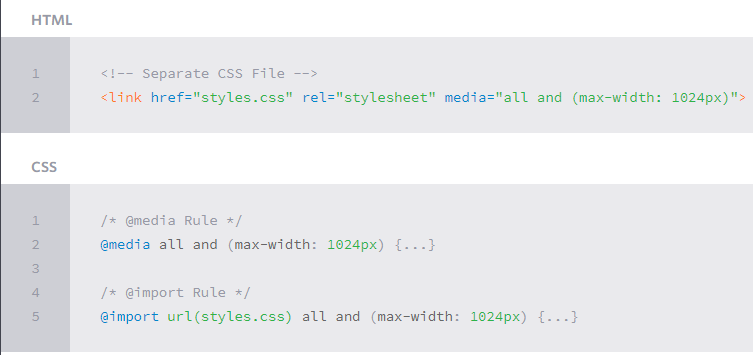
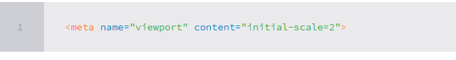
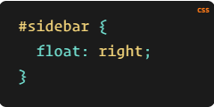
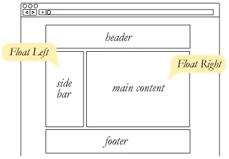
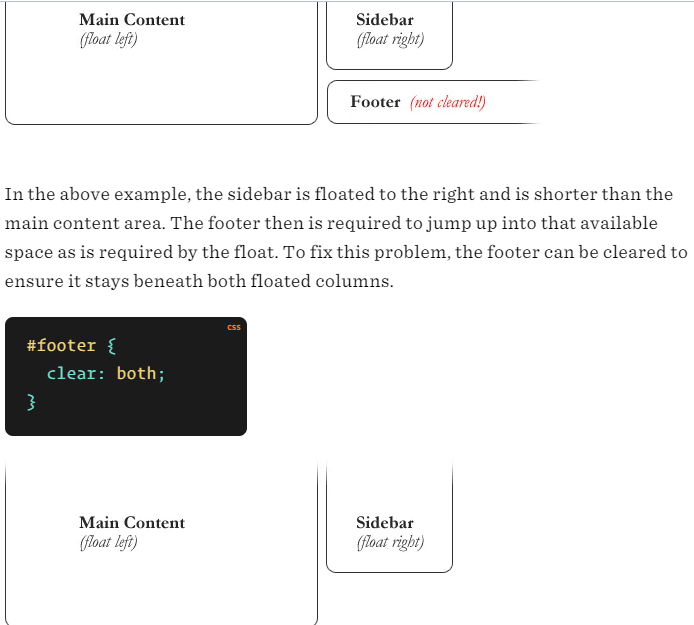
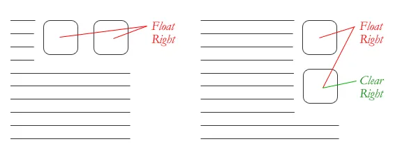
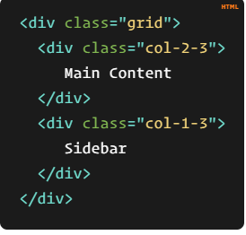

# Responsive Web Design

is the practice of building a website suitable to work on every device and every screen size, no matter how large or small, mobile or desktop. Responsive web design is focused around providing an intuitive and gratifying experience for everyone. Desktop computer and cell phone users alike all benefit from responsive websites.

## Responsive vs. Adaptive vs. Mobile

Responsive generally means to react quickly and positively to any change.
adaptive means to be easily modified for a new purpose or situation, such as change.
A combination of the two is ideal, providing the perfect formula for functional websites. Which term is used specifically doesn’t make a huge difference.

Mobile, on the other hand, generally means to build a separate website commonly on a new domain solely for mobile users.Mobile websites can be extremely light but they do come with the dependencies of a new code base and browser sniffing, all of which can become an obstacle for both developers and users.

Currently the most popular technique lies within responsive web design

## Flexible Layouts

Responsive  web design split to three components

1. flexible layout
2. media queries
3. flexible media

flexible layouts, is the practice of building the layout of a website with a flexible grid, capable of dynamically resizing to any width.
Flexible grids are built using relative length units, most commonly percentages or em units. These relative lengths are then used to declare common grid property values such as width, margin, or padding.

Media queries were built as an extension to media types commonly found when targeting and including styles. Media queries provide the ability to specify different styles for individual browser and device circumstances, the width of the viewport or device orientation

There are a couple different ways to use media queries, using the @media rule inside of an existing style sheet, importing a new style sheet using the @import rule, or by linking to a separate style sheet from within the HTML document.

Logical Operators in Media Queries
Logical operators in media queries help build powerful expressions. There are three different logical operators available for use within media queries, including and, not, and only.

Mobile First
The mobile first approach includes using styles targeted at smaller viewports as the default styles for a website, then use media queries to add styles as the viewport grows

Using the viewport meta tag with either the height or width values will define the height or width of the viewport respectively.

Viewport Scale
To control how a website is scaled on a mobile device, and how users can continue to scale a website, use the minimum-scale, maximum-scale, initial-scale, and user-scalable properties.

Flexible Media
Equally important aspect to responsive web design involves flexible media. As viewports begin to change size media doesn’t always follow suit. Images, videos, and other media types need to be scalable, changing their size as the size of the viewport changes.

## All About Floats

Float is a CSS positioning property. To understand its purpose and origin, we can look to print design.

Setting the float on an element with CSS happens like this:

Clearing the Float
Float’s sister property is clear. An element that has the clear property set on it will not move up adjacent to the float like the float desires.

Problems with Floats

1. Pushdown

2. Double Margin Bug :if you apply a margin in the same direction as the float, it will double the margin. Quick fix: set display: inline on the float
3. The 3px Jog is when text that is up next to a floated element
4. the Bottom Margin Bug is when if a floated parent has floated children inside it, bottom margin on those children is ignored by the parent.

Columns
Let’s start with a practical and common need: a main content area being 2/3 the width and a sidebar being 1/3 the width. We just make two column divs with appropriate class names.

The hardest part about grids is gutters. So far we’ve made our grid flexible by using percentages for widths. We could make the math all complicated and use percentages for gutters as well

The first step toward this is using box-sizing: border-box;. I like using it on absolutely everything.

The second step is applying a fixed padding to the right side of all columns except the last one.

## CSS Floats

floats create three flows

1. Left
2. Normal
3. Right

Floats: Left and Right
Using floats can introduce up to two new flows: left and right.

And this allows the normal flow of elements, those without a float value, to fill in the spaces around these elements.

The Clear Property
“Clear” allows elements to specify where they should align in comparison to the floated elements.

## SMACSS

is style guide There is no library within here for you to download or install. There is no git repository for you to clone. SMACSS is a way to examine your design process and as a way to fit those rigid frameworks into a flexible thought process.
