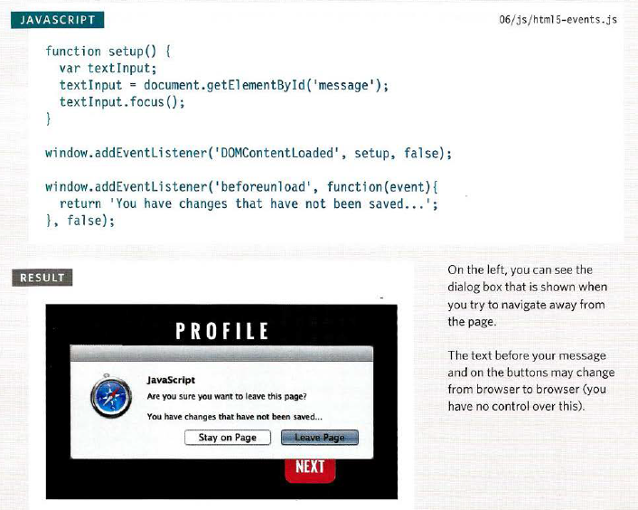
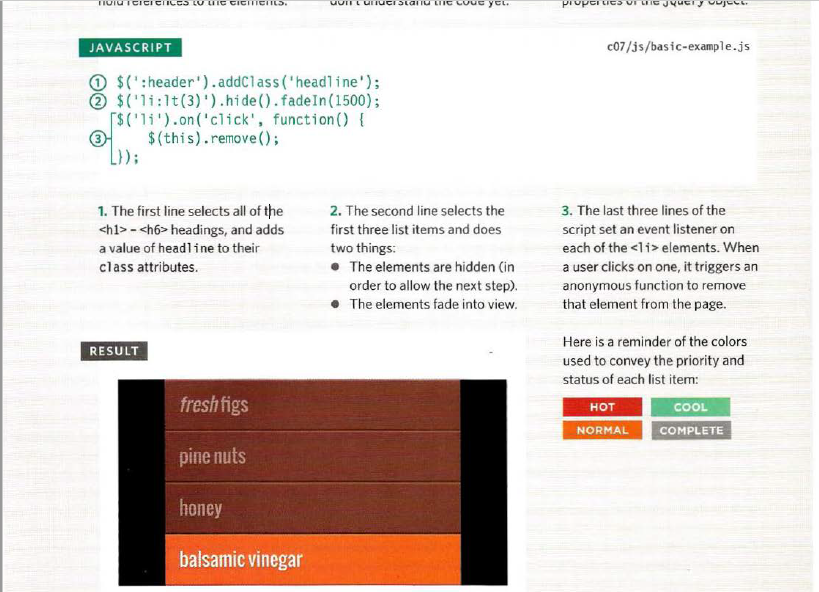
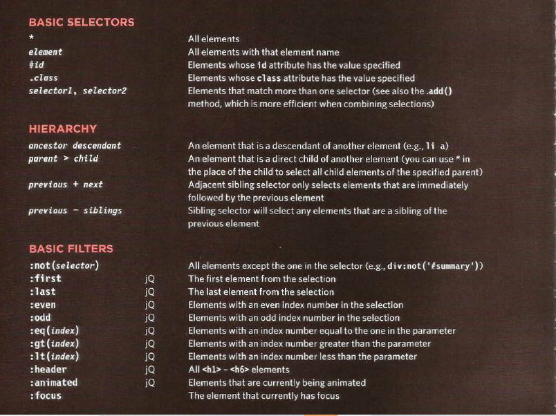
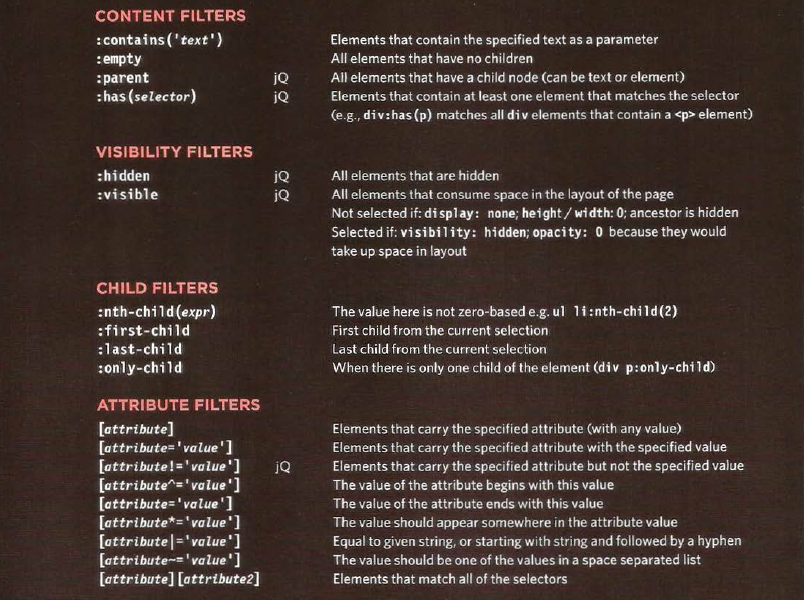
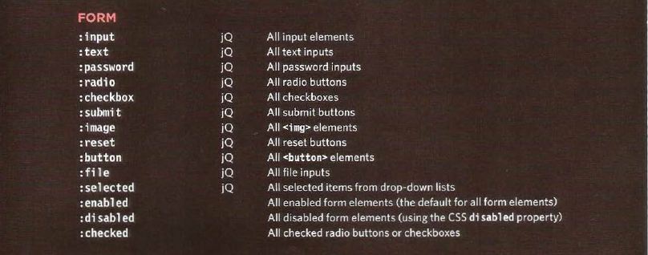
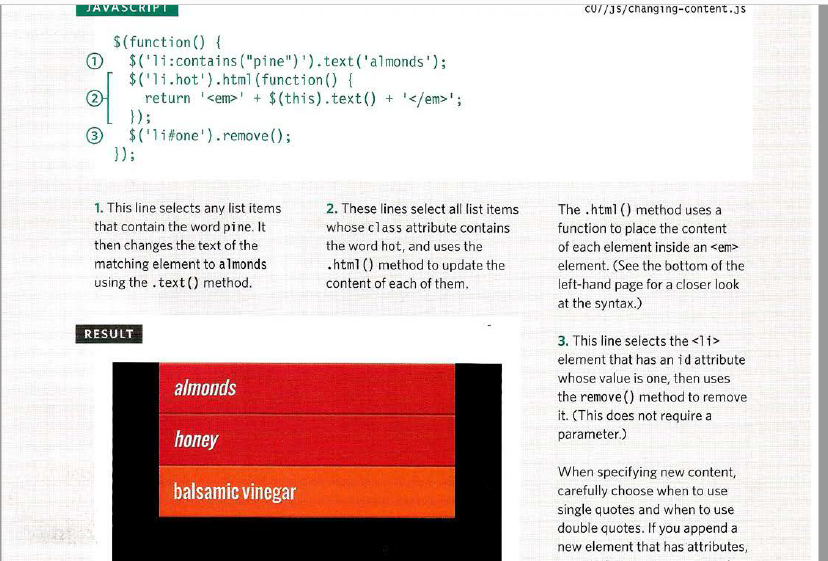
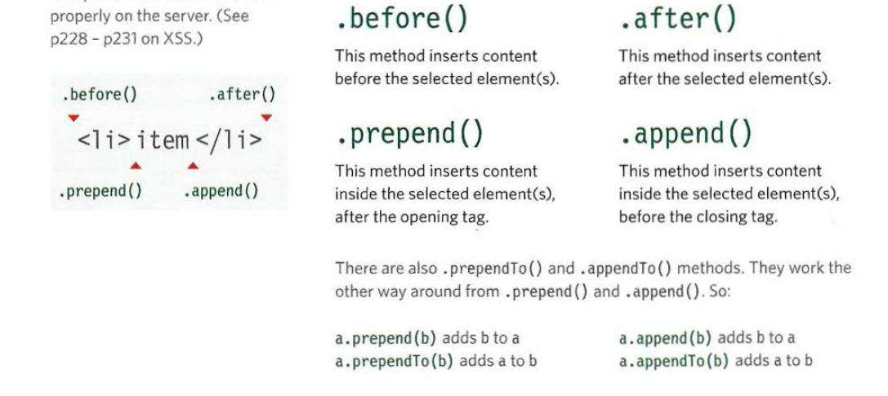
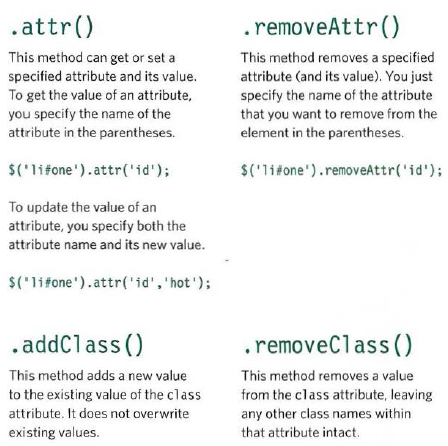
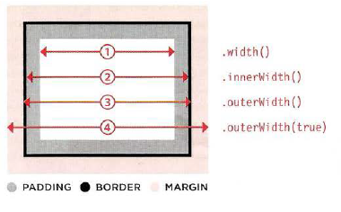

# HTMLS EVENTS

we have three pafe-level events

1. DOMContentLoaded:event fires when the initial HTML document has been completely loaded and parsed.
2. hashchange:Hashes are used on links to specific parts(sometimes known as anchors) within a page and also on pagesthat use AJAX to load content. The hashchange event handlerworks on the window object, and after firing.
3. beforeunload:event is fired when the window, the document and its resources are about to be unloaded. The document is still visible and the event is still cancelable at this point.

## JQUERY

### WHY USE JQUERY?

it makes coding simpler.

jQuery has methods that offer web developers
simpler ways to perform common tasks, such as:

* loop through elements
* Add I remove elements from the DOM tree
* Handle events
* Fade elements into I out of view
* Handle Ajax requests

### DOING THINGS WITH YOUR SELECTION

.html(),.text(),.replaceWith(),. remove()
. find(),.closest(),. parent(),.parents()

you can get the content from .html() method

check the page is ready to work .ready() method  and function inside it will run

## GETTING AND SETTING ATTRIBUTE VALUES

## BOX DIMENSIONS
These methods allow you to discover or update
the width and height of all boxes on the page.

| METHOD | DESCRIPTION |
| ---  | --- |
| . height()| Height of box (no margin, border, padding)|
|.width()| Width of box (no margin, border, padding) |
|.innerHeight() |Height of box plus padding |
|.innerWidth() | Width of box plus padding |
|.outerHeight() | Height of box plus padding and border|
| .outerWidth() | Width of box plus padding and border |
|.outerHeight (true) |Height of box plus padding, border, and margin|
|.outerWidth(true) |Width of box plus padding, border, and margin|

## 6 Reasons for Pair Programming

Iterative loops. Code reviews. Fast feedback. Error checking and linting. These are software engineering practices that have proven to dramatically improve the quality of code developers produce.

1. Greater efficiency
2. Engaged collaboration
3. Learning from fellow students
4. Social skills
5. Job interview readiness
6. Work environment readiness
