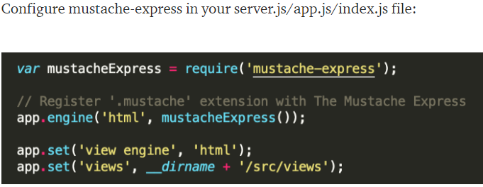
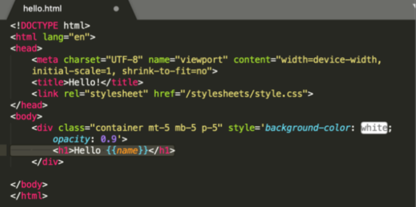
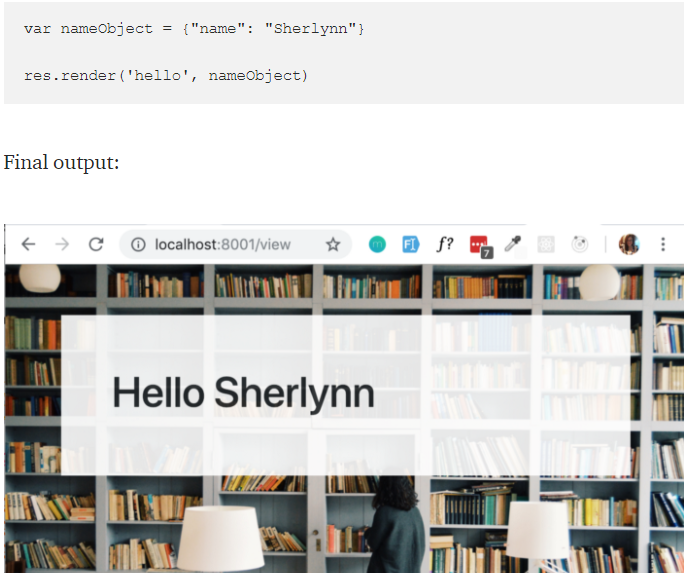

# Javascript Templating

Javascript templating is a fast and efficient technique to render client-side view templates with Javascript by using a JSON data source. The template is HTML markup, with added templating tags that will either insert variables or run programming logic

Mustache is a logic-less template syntax. It can be used for HTML, config files, source code — anything.

It is often referred to as “logic-less” because there are no if statements, else clauses, or for loops. Instead, there are only tags. Some tags are replaced with a value, some nothing, and others a series of values.

if you want to install Mustache-Express use command in your terminal

$ npm install mustache --save

## Guide to Flexbox

The Flexbox Layout (Flexible Box) aims at providing a more efficient way to layout, align and distribute space among items in a container, even when their size is unknown and/or dynamic

The main idea behind the flex layout is to give the container the ability to alter its items’ width/height (and order) to best fill the available space

flex properties:
for parent
inline or block (display:flex)
flex-direction(flex-direction:row | row-reverse | column | column-reverse;)
(flex-wrap: nowrap | wrap | wrap-reverse)
 flex-flow: column wrap;
 justify-content: flex-start | flex-end | center | space-between | space-around | space-evenly | start | end | left | right ... + safe | unsafe;
 align-items: stretch | flex-start | flex-end | center | baseline | first baseline | last baseline | start | end | self-start | self-end + ... safe | unsafe;
  align-content: flex-start | flex-end | center | space-between | space-around | space-evenly | stretch | start | end | baseline | first baseline | last baseline + ... safe | unsafe;

Properties for the Children
(flex items)
 order(order: 5)
 flex-grow: 4
 flex-shrink: 3
 flex-basis:  | auto
flex: none | [ <'flex-grow'> <'flex-shrink'>? || <'flex-basis'> ]
align-self: auto | flex-start | flex-end | center | baseline | stretch;