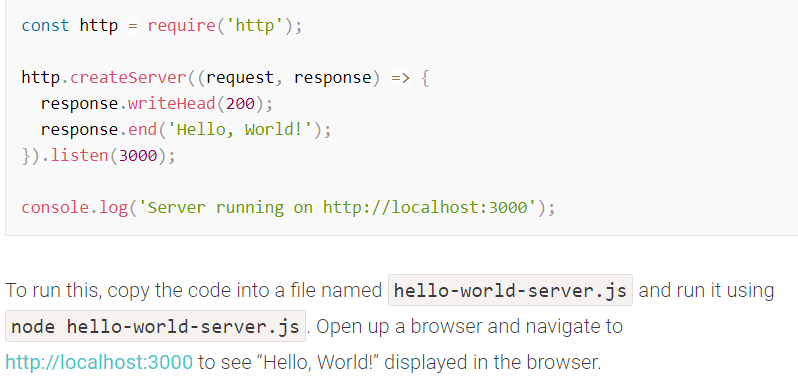

# Node.js

What Is Node and When Should I Use It?

Node.js is a JavaScript runtime built on Chrome’s V8 JavaScript engine

The V8 engine : is the open-source JavaScript engine that runs in Google Chrome and other Chromium-based web browsers, including Brave, Opera, and Vivaldi. It was designed with performance in mind and is responsible for compiling JavaScript directly to native machine code that your computer can execute.

Use a version manager. This is a program that allows you to install multiple versions of Node and switch between them at will. There are various advantages to using a version manager.

You can check that Node is installed on your system by opening a terminal and typing node -v. If all has gone well, you should see something like v12.14.1 displayed. This is the current LTS version at the time of writing.

npm, the JavaScript Package Manager

To check which version you have installed on your system, type npm -v.

npm is also the world’s largest software registry. There are over 1,000,000 packages of JavaScript code available to download, with billions of downloads per week. Let’s take a quick look at how we would use npm to install a package.

## What Is Node.js Used For?

can be used for anything from bundling your JavaScript files and dependencies into static assets, to running tests, or automatic code linting and style checking.

And if you want to start developing apps with any modern JavaScript framework (for example, React or Angular), you’ll be expected to have a working knowledge of Node and npm (or maybe Yarn). This isn’t because you need a Node back end to run these frameworks. You don’t. Rather, it’s because these frameworks (and many, many related packages) are all available via npm and rely on Node to create a sensible development environment in which they can run.

### Node.js Lets Us Run JavaScript on the Server

Node.js, is single-threaded. It’s also event-driven, which means that everything that happens in Node is in reaction to an event.




We start by requiring Node’s native HTTP module. We then use its createServer method to create a new web server object, to which we pass an anonymous function. This function will be invoked for every new connection that’s made to the server.

The anonymous function is called with two arguments (request and response). These contain the request from the user and the response, which we use to send back a 200 HTTP status code, along with our “Hello World!” message.

Finally, we tell the server to listen for incoming requests on port 3000, and output a message to the terminal to let us know it’s running.

### What Kind of Apps Is Node.js Suited To?

Node is particularly suited to building applications that require some form of real-time interaction or collaboration — for example, chat sites, or apps such as CodeShare, where you can watch a document being edited live by someone else.

### What Are the Advantages of Node.js?

Aside from speed and scalability, an often-touted advantage of using JavaScript on a web server — as well as in the browser — is that your brain no longer needs to switch modes. You can do everything in the same language, which, as a developer, makes you more productive (and hopefully, happier). For example, you can easily share code between the server and the client.

```
Node.js is an event-based, non-blocking, asynchronous I/O runtime that uses Google’s V8 JavaScript engine and libuv library.
```
