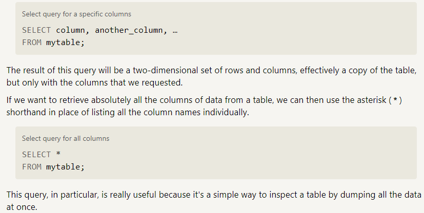
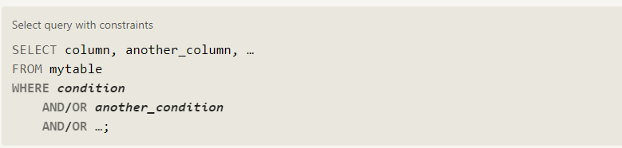
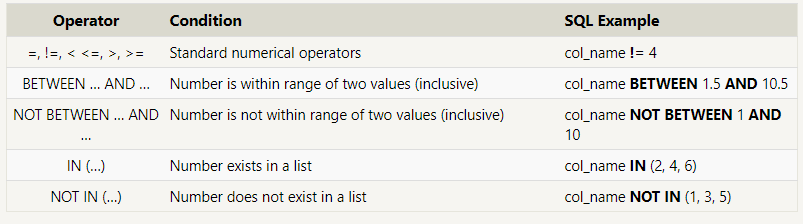
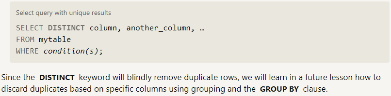
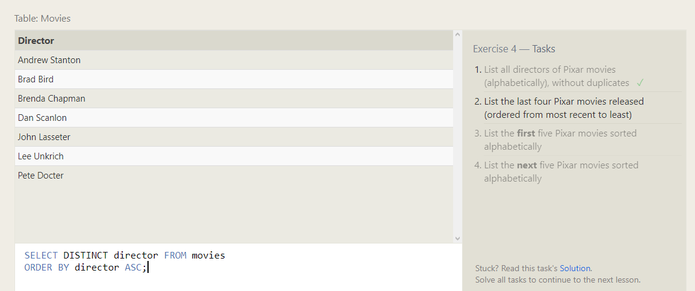
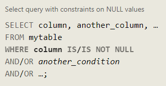
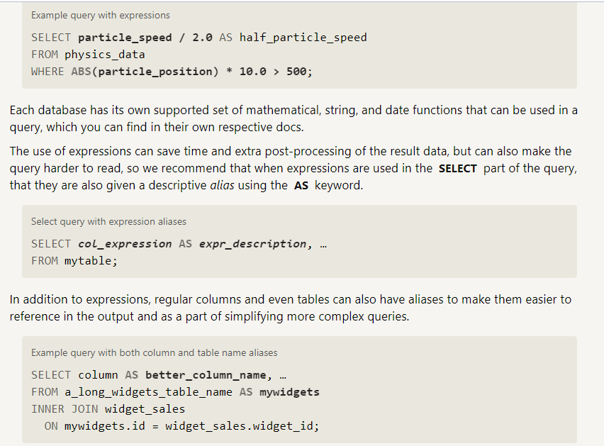
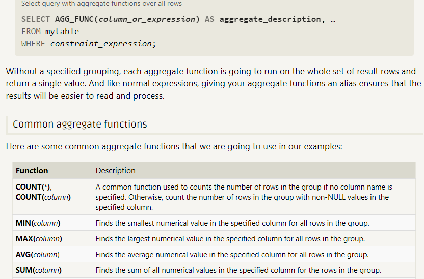

# SQL

SQL, or Structured Query Language, is a language designed to allow both technical and non-technical users query, manipulate, and transform data from a relational database. And due to its simplicity, SQL databases provide safe and scalable storage for millions of websites and mobile applications.

## SQL Lesson 1: SELECT queries 101

To retrieve data from a SQL database, we need to write SELECT statements, which are often colloquially refered to as queries.

## SQL Lesson 2: Queries with constraints

 if you had a table with a hundred million rows of data, reading through all the rows would be inefficient and perhaps even impossible.

In order to filter certain results from being returned, we need to use a WHERE clause in the query. The clause is applied to each row of data by checking specific column values to determine whether it should be included in the results or not.

## SQL Lesson 4: Filtering and sorting Query results

Even though the data in a database may be unique, the results of any particular query may not be – take our Movies table for example, many different movies can be released the same year. In such cases, SQL provides a convenient way to discard rows that have a duplicate column value by using the DISTINCT keyword.

## SQL Lesson 8: A short note on NULLs

## SQL Lesson 9: Queries with expressions

you can also use expressions to write more complex logic on column values in a query. These expressions can use mathematical and string functions along with basic arithmetic to transform values when the query is executed, as shown in this physics example.

## SQL Lesson 10: Queries with aggregates

## SQL Lesson 12: Order of execution of a Query

Query order of execution
1. FROM and JOINs
The FROM clause, and subsequent JOINs are first executed to determine the total working set of data that is being queried. This includes subqueries in this clause, and can cause temporary tables to be created under the hood containing all the columns and rows of the tables being joined.

2. WHERE
Once we have the total working set of data, the first-pass WHERE constraints are applied to the individual rows, and rows that do not satisfy the constraint are discarded. Each of the constraints can only access columns directly from the tables requested in the FROM clause. Aliases in the SELECT part of the query are not accessible in most databases since they may include expressions dependent on parts of the query that have not yet executed.

3. GROUP BY
The remaining rows after the WHERE constraints are applied are then grouped based on common values in the column specified in the GROUP BY clause. As a result of the grouping, there will only be as many rows as there are unique values in that column. Implicitly, this means that you should only need to use this when you have aggregate functions in your query.

4. HAVING
If the query has a GROUP BY clause, then the constraints in the HAVING clause are then applied to the grouped rows, discard the grouped rows that don't satisfy the constraint. Like the WHERE clause, aliases are also not accessible from this step in most databases.

5. SELECT
Any expressions in the SELECT part of the query are finally computed.

6. DISTINCT
Of the remaining rows, rows with duplicate values in the column marked as DISTINCT will be discarded.

7. ORDER BY
If an order is specified by the ORDER BY clause, the rows are then sorted by the specified data in either ascending or descending order. Since all the expressions in the SELECT part of the query have been computed, you can reference aliases in this clause.

8. LIMIT / OFFSET
Finally, the rows that fall outside the range specified by the LIMIT and OFFSET are discarded, leaving the final set of rows to be returned from the query.

## SQL Lesson 13: Inserting rows

We previously described a table in a database as a two-dimensional set of rows and columns, with the columns being the properties and the rows being instances of the entity in the table. In SQL, the database schema is what describes the structure of each table, and the datatypes that each column of the table can contain.

Example: Correlated subquery
For example, in our Movies table, the values in the Year column must be an Integer, and the values in the Title column must be a String.

This fixed structure is what allows a database to be efficient, and consistent despite storing millions or even billions of rows.

