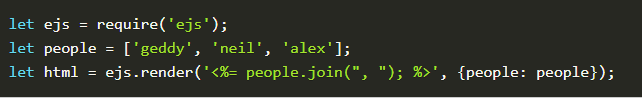
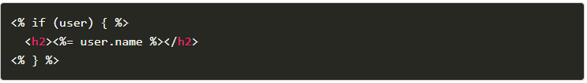

# EJS

## Embedded JavaScript templating

EJS is a simple templating language that lets you generate HTML markup with plain JavaScript. No religiousness about how to organize things.

## Install

It's easy to install EJS with NPM.

$ npm install ejs

Use

using if :

## Tags

* <% 'Scriptlet' tag, for control-flow, no output
* <%_ ‘Whitespace Slurping’ Scriptlet tag, strips all whitespace before it
* <%= Outputs the value into the template (HTML escaped)
* <%- Outputs the unescaped value into the template
* <%# Comment tag, no execution, no output
* <%% Outputs a literal '<%'
* %> Plain ending tag
* -%> Trim-mode ('newline slurp') tag, trims following newline
* _%> ‘Whitespace Slurping’ ending tag, removes all whitespace after it