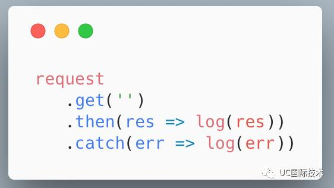
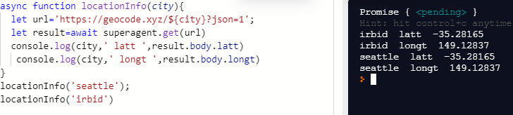

# Node Ecosystem, TDD, CI/CD

## array.map() Method

method creates a new array with the results of calling a function for every array element.
Argument used with array.map:

1. currentValue:(Required) The value of the current element
2. index:(Optional) The array index of the current element

## array.reduce() Method

method reduces the array to a single value,and executes a provided function for each value of the array, return value of the function is stored in an accumulator

Argument used in array.reduce():

1. total:(Required) The initialValue, or the previously returned value of the function
2. currentValue:(Required) The value of the current element
3. currentIndex:(Optional) The array index of the current element

## SuperAgent

SuperAgent is light-weight progressive ajax API crafted for flexibility, readability, and a low learning curve after being frustrated with many of the existing request APIs. It also works with Node.js.

A request can be initiated by invoking the appropriate method on the request object, then calling .then() (or .end() or await) to send the request. For example a simple GET request:

*.then example*

*async /await example*

## Promise

The Promise object represents the eventual completion (or failure) of an asynchronous operation and its resulting value.
It allows you to associate handlers with an asynchronous action's eventual success value or failure reason. This lets asynchronous methods return values like synchronous methods: instead of immediately returning the final value, the asynchronous method returns a promise to supply the value at some point in the future.

## Are all callback functions considered to be Asynchronous? Why or Why Not?

not asynchronous.For example there's forEach in Array. It iterates over each item and calls the function once per item.
