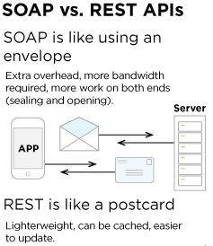

# Express

## What’s the difference between PUT and PATCH?

PUT is a method of modifying resource where the client sends data that updates the entire resource. It is used to set an entity’s information completely.
PATCH applies a partial update to the resource.This means that you are only required to send the data that you want to update, and it won’t affect or change anything else.

## Provide links to 3 services or tools that allow you to “mock” an API for development like json-server

1. [postman](https://www.postman.com/features/mock-api/)
2. [mockoon](https://mockoon.com/)
3. [json-server](https://www.npmjs.com/package/json-server)

## Compare and contrast Swagger and APIDoc.js 1 Which HTTP status codes should be sent with each type of (un)successful API call?

### Swagger

'200':
description: OK
'400':
description: Bad request. User ID must be an integer and larger than 0.
'401':
 description: Authorization information is missing or invalid.
'404':
description: A user with the specified ID was not found.
'5XX':
description: Unexpected error.

### APIDoc

200(ok)
400(Bad Request)
401(4Not Authenticated)
404(Not found)
4xx (errors)

## Compare and contrast SOAP and REST

`Web Server`
A web server is a software that uses HTTP and other protocols to respond to client requests made over the World Wide Web. The main job of a web server is to display website content through storing, processing and delivering webpages to users.

`Express`
Express is the most popular Node web framework, and is the underlying library for a number of other popular Node web frameworks.

`Routing`
Routing defines the way in which the client requests are handled by the application endpoints.

`WRRC`
Web Request Response Cycle diagram that describe the flow of data in req/res cycle.
