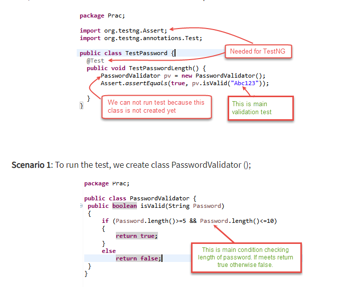

# Express REST API

- True or false: The route handler is middleware? `false`

- In what ways can a middleware function end the process and send data to the browser?

If the current middleware function does not end the request-response cycle, it must call next() to pass control to the next middleware function. Otherwise, the request will be left hanging.

- At what point in the request lifecycle can you “inject” middleware?

 begin of the requests

 What can cause express to error with “Request headers sent twice, cannot start a second response”

 `Middleware` : functions are functions that have access to the request object (req), the response object (res), and the next middleware function in the application’s request-response cycle. The next middleware function is commonly denoted by a variable named next.

 `Request Object` :Represents the information in the HTTP request from the client to the server.

 `Response Object`
Information in the HTTP response from the server to the client.

`Application Middleware`

Bind application-level middleware to an instance of the app object by using the app.use() and app.METHOD() functions, where METHOD is the HTTP method of the request that the middleware function handles (such as GET, PUT, or POST) in lowercase.

This example shows a middleware function with no mount path. The function is executed every time the app receives a request.

var express = require('express')
var app = express()

app.use(function (req, res, next) {
  console.log('Time:', Date.now())
  next()
})

`Routing middleware`
Router-level middleware works in the same way as application-level middleware, except it is bound to an instance of express.Router().

`Test Driven Development`

is a software development process relying on software requirements being converted to test cases before software is fully developed, and tracking all software development by repeatedly testing the software against all test cases. This is opposed to software being developed first and test cases created later.

`Behavioral Testing`
Behavioural Testing is a testing of the external behaviour of the program, also known as black box testing. It is usually a functional testing.

is a branch of Test Driven Development (TDD). BDD uses human-readable descriptions of software user requirements as the basis for software tests.