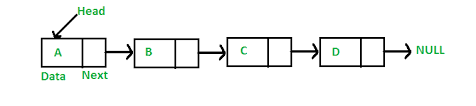

# Linked Lists

## What is a Linked List

A Linked List is a sequence of Nodes that are connected/linked to each other. The most defining feature of a Linked List is that each Node references the next Node in the link.

## Terminology

type of linked list
`Singly` A Singly linked list means that there is only one reference, and the reference points to the Next node in a linked list.
`Doubly` A Doubly linked list means that there is a reference to both the Next and Previous node.

`Node`  Nodes are the individual items/links that live in a linked list. Each node contains the data for each link.

`Next`  This property contains the reference to the next node.

`Head`  The Head is a reference of type Node to the first node in a linked list.

`Current`  The Current is a reference of type Node to the node that is currently being looked at.

## Traversal

* create a current as a pointer on the Head to guarantee that are starting from the beginning
* create while loop. This loop will still run until the current is pointing on null.
* check if the value of current is equal to the value that looking for.
* If current does not contain a value, make the current as pointer on the next node.
* Once the condition becomes true, the while loop breaks
* Once the current hit the end, it means did not find the value, so return false.

complexity:

time: O(n) (worse case) the node which has the value that searches for it is last

space: O(1) This because there is no additional space being used

## Adding a Node

to add newnode

1. newNode.next it's null should refrence to so make it to same location of the head.
2.reassign the head to the first node.
