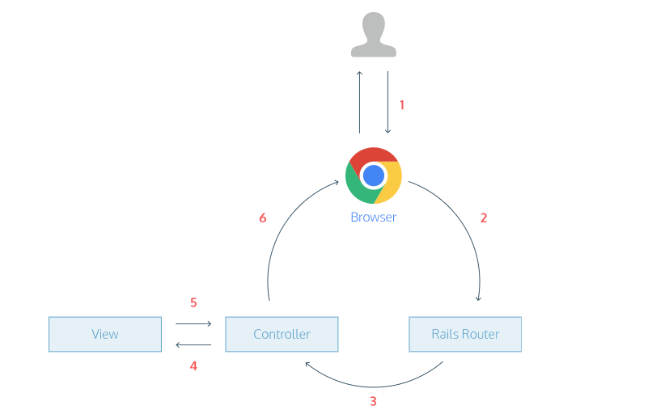

# AWS: Cloud Servers

1. Describe the Web-Request-Response-Cycle

   1. A user opens his browser, types in a URL, and presses Enter.
   2. When a user presses Enter, the browser makes a request for that URL.
   3. The request hits the Rails router (config/routes.rb). The router maps the URL to the correct controller and action to handle the request.
   4. The action receives the request and passes it on to the view.
   5. The view renders the page as HTML.
   6. The controller sends the HTML back to the browser. The page loads and the user sees it.

   

2. Explain what a “server” is, as it relates to the WRRC
is a computer or system that provides resources, data, services, or programs to other computers

3. What does it mean to “deploy” an application?

putting it on a Web server so that it can be used either through the Internet or an intranet. This Web server might be your local UNIX system, while you develop and debug your application to check that the application is performing as you expect, or a different UNIX system for users of your application.

`Server`is a piece of computer hardware or software (computer program) that provides functionality for other programs or devices, called "clients".

`Pub/Sub` Publish/subscribe messaging, or pub/sub messaging, is a form of asynchronous service-to-service communication used in serverless and microservices architectures. In a pub/sub model, any message published to a topic is immediately received by all of the subscribers to the topic.
