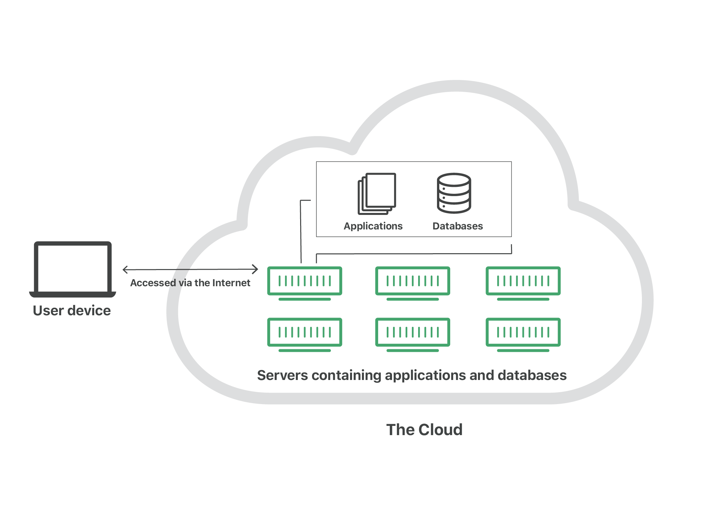

# AWS: S3 and Lambda

## Describe The Cloud

"The cloud" refers to servers that are accessed over the Internet, and the software and databases that run on those servers. Cloud servers are located in data centers all over the world. By using cloud computing, users and companies don't have to manage physical servers themselves or run software applications on their own machines.

## What is a container (as it relates to computers and servers)?

Containers are a solution to the problem of how to get software to run reliably when moved from one computing environment to another. This could be from a developer's laptop to a test environment, from a staging environment into production, and perhaps from a physical machine in a data center to a virtual machine in a private or public cloud.

## What is auto-scaling?

Auto Scaling monitors your applications and automatically adjusts capacity to maintain steady, predictable performance at the lowest possible cost. Using AWS Auto Scaling, it’s easy to setup application scaling for multiple resources across multiple services in minutes. The service provides a simple, powerful user interface that lets you build scaling plans for resources including Amazon EC2 instances and Spot Fleets, Amazon ECS tasks, Amazon DynamoDB tables and indexes, and Amazon Aurora Replicas. AWS Auto Scaling makes scaling simple with recommendations that allow you to optimize performance, costs, or balance between them.

## What is bandwidth?

Bandwidth is measured as the amount of data that can be transferred from one point to another within a network in a specific amount of time. Typically, bandwidth is expressed as a bitrate and measured in bits per second (bps).

## How do cloud providers compute service costs?

cloud providers determine the expense to maintaining the network. They start by calculating costs for network hardware, network infrastructure maintenance, and labor. These expenses are added together and then divided by the number of rack units a business will need for its IaaS cloud.

## Term

`Server Instances`An instance is a single copy of the software running on a single physical or virtual server. If you run two copies of the software on the same physical or virtual server, that counts as two instances.

`Containers`Containers are a solution to the problem of how to get software to run reliably when moved from one computing environment to another.

`Cloud Services`are services available via a remote cloud computing server rather than an on-site server

`Cloud Architecture`various components in terms of databases, software capabilities, applications, etc. engineered to leverage the power of cloud resources to solve business problems. Cloud architecture defines the components as well as the relationships between them.

`AWS`Amazon web service is an online platform that provides scalable and cost-effective cloud computing solutions.

`EC2/Beanstalk vs Heroku`Heroku is suitable for Startups, Medium Businesses whereas AWS is mainly focused on Medium Businesses and Large Enterprises

## AWS S3

Amazon Simple Storage Service (Amazon S3) is an object storage service that offers industry-leading scalability, data availability, security, and performance. This means customers of all sizes and industries can use it to store and protect any amount of data for a range of use cases, such as data lakes, websites, mobile applications, backup and restore, archive, enterprise applications, IoT devices, and big data analytics. 

## AWS Lambda Basics

AWS Lambda is a serverless computing service provided by Amazon Web Services (AWS). Users of AWS Lambda create functions, self-contained applications written in one of the supported languages and runtimes, and upload them to AWS Lambda, which executes those functions in an efficient and flexible manner.

Each Lambda function runs in its own container. When a function is created, Lambda packages it into a new container and then executes that container on a multi-tenant cluster of machines managed by AWS. Before the functions start running, each function’s container is allocated its necessary RAM and CPU capacity. Once the functions finish running, the RAM allocated at the beginning is multiplied by the amount of time the function spent running. The customers then get charged based on the allocated memory and the amount of run time the function took to complete.

The entire infrastructure layer of AWS Lambda is managed by AWS. Customers don’t get much visibility into how the system operates, but they also don’t need to worry about updating the underlying machines, avoiding network contention, and so on—AWS takes care of this itself.

## Content Delivery Network (CDN)

is a geographically distributed group of servers that work together to provide fast delivery of Internet content. A CDN allows for the fast transfer of data needed for loading Internet content including HTML pages, javascript files, stylesheets, images, and videos.

CDNs work through servers nearest to the website visitor respond to the request. The content delivery network copies the pages of a website to a network of servers that are spread out at geographically different locations, caching the contents of the page. When a user requests a webpage that is part of a content delivery network, the CDN will redirect the request from the originating site’s server to a server in the CDN that is closest to the user and deliver the cached content. CDNs will also communicate with the originating server to deliver any content that has not been previously cached. 