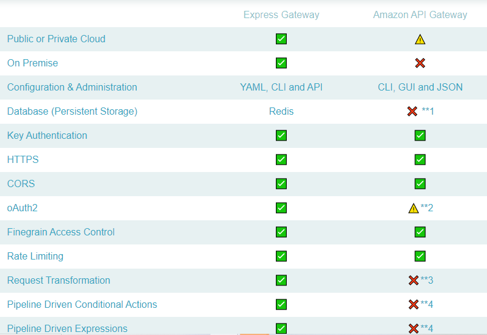
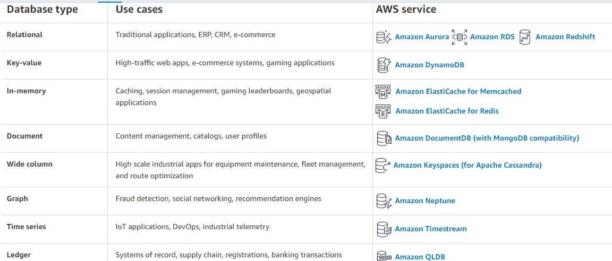

# AWS: Events

## Describe the similarities between AWS API Gateway + Lambda functions and an ExpressJS Server

## List the AWS Database offerings and talk about the pros and cons of each

## Term

`Serverless API`are application designs that incorporate third-party “Backend as a Service” (BaaS) services, and/or that include custom code run in managed.

`Triggers` an AWS Lambda resource or resource in another service that you configure to invoke your function in response to lifecycle events, external requests or on a schedule, a function can have multiple triggers

`Dynamo vs Mongo`:
Mongo can be deployed anywhere, Dynamo is only available on AWS
Mongo is JSON based document store, Dynamo is limited key-value store with JSON support
Mongo is rich query language, Dynamo is key-value queries

`Dynamoose vs Mongoose`: Dynamoose is a DynamoDB API structured like Mongoose, lets us provide a schema and perform CRUD operations against a DynamoDB table, installed via node and configured based on role

## SQS and SNS

## SQS (Simple Queue Service)

* Distributed queuing system
* Messages are not pushed to receivers, receivers have to poll SQS to receive messages
* Messages can’t be received by multiple receivers at the same time
* Anyone's receiver can receive a message, process and delete it, other receivers do not receive the same message later
* Mainly used to decouple applications or integrate applications
* Messages can be stored in SQS for a short duration of time (max 14 days)

## SNS (Simple Notification Service)

* Fast, flexible, and fully managed push notification service that lets you send individual messages or bulk messages
* Distributed publish/subscribe system
* Messages are pushed to subscribers as and when they are sent by publishers to SNS
* SNS supports several end points such as email, SMS, HTTP endpoint, and SQS
* If you want an unknown number and type of subscribers to receive messages, you need SNS
